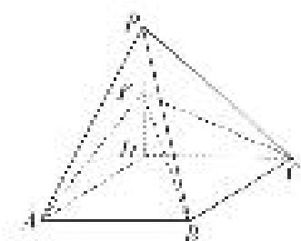

<!-- question-source:start -->
6. 如图，在四棱锥 $P - ABCD$ 中，底面 $ABCD$ 为边长为 2 的菱形， $\angle DAB = 60^{\circ}$ ， $\angle ADP = 90^{\circ}$ ，平面 $ADP \perp$ 平面 $ABCD$ ，点 $F$ 为棱 $PD$ 的中点.

(1)在棱 $AB$ 上是否存在一点 $E$ , 使得 $AF \parallel$ 平面 $PCE$ ? 并说明理由;

(2)当二面角 D-FC-B 的余弦值为 $\frac{\sqrt{2}}{4}$ 时，求直线 PB 与平面 ABCD 所成的角.

<!-- question-source:end -->

![[高中/总复习/专题/立体几何/专题12 利用空间向量计算空间角的综合问题-立体几何（理科）/考点02_已知某一空间角求另一空间角/对点训练/answers/Q00043804A1.md]]
