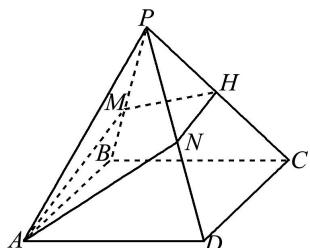
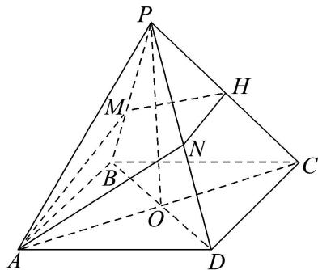
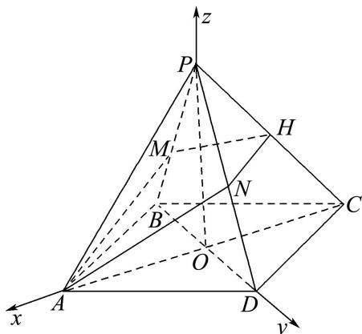

> [!faq]- 《专题12 利用空间向量计算空间角的综合问题-立体几何（理科）》例题解析
>
> > [!success]- **【答案】** 详见解析
>
> > [!note]- **【分析】**
> > 本题未单列分析。
>
> > [!note]- **【解析】**
> > (1)证明： $MN \perp PC;$
> >
> > (2)当 $H$ 为 $PC$ 的中点， $PA = PC = \sqrt{3} AB$ ， $PA$ 与平面ABCD所成的角为 $60^{\circ}$ ，求 $AD$ 与平面AMHN所成角的正弦值.
> >
> > 
> >
> > 1. 解析
> > (1) 连接 AC, BD 且 $AC \cap BD = O$ ，连接 PO.
> >
> > 
> >
> > 因为 $ABCD$ 为菱形，所以 $BD \perp AC$ 。因为 $PD = PB$ ，所以 $PO \perp BD$ 。
> >
> > 因为 $AC \cap PO = O$ ，且 $AC$ ， $PO \subset$ 平面 $PAC$ ，所以 $BD \perp$ 平面 $PAC$ 。
> >
> > 因为 $PC \subset$ 平面 $PAC$ ，所以 $BD \perp PC$ 。因为 $BD \parallel$ 平面 $AMHN$ ，
> >
> > 且平面 $AMHN \cap$ 平面 $PBD = MN$ ，所以 $BD \parallel MN$ ， $MN \perp$ 平面 $PAC$ ，所以 $MN \perp PC$ 。
> >
> > (2)由
> > (1)知 $BD \perp AC$ 且 $PO \perp BD$ 。因为 $PA = PC$ ，且 $O$ 为 $AC$ 的中点，
> >
> > 所以 $PO \perp AC$ ，所以 $PO \perp$ 平面 $ABCD$ ，所以 $PA$ 与平面 $ABCD$ 所成的角为 $\angle PAO$ ，
> >
> > 所以 $\angle PAO = 60^\circ$ ，所以 $AO = \frac{1}{2} PA$ ， $PO = \frac{\sqrt{3}}{2} PA$ 。因为 $PA = \sqrt{3} AB$ ，所以 $BO = \frac{\sqrt{3}}{6} PA$ 。
> >
> > 以 $O$ 为原点， $OA$ ， $OD$ ， $OP$ 分别为 $x$ 轴、 $y$ 轴、 $z$ 轴建立如图所示空间直角坐标系。
> >
> > 
> >
> > 设 PA=2，所以 $O(0,0,0)$ ， $A(1,0,0)$ ， $B\left(0,-\frac{\sqrt{3}}{3},0\right)$ ， $C(-1,0,0)$ ， $D\left(0,\frac{\sqrt{3}}{3},0\right)$ ， $P(0,0,\sqrt{3})$
> >
> > $$
> > H \left[ - \frac {1}{2}, 0, \frac {\sqrt {3}}{2} \right],
> > $$
> >
> > 所以 $\overrightarrow{BD} = \left(0, \frac{2\sqrt{3}}{3}, 0\right)$ , $\overrightarrow{AH} = \left(-\frac{3}{2}, 0, \frac{\sqrt{3}}{2}\right)$ , $\overrightarrow{AD} = \left(-1, \frac{\sqrt{3}}{3}, 0\right)$ .
> >
> > 设平面 AMHN 的法向量为 $\boldsymbol{n}=(x,y,z)$ ，所以 $\left\{\begin{aligned}\boldsymbol{n}\cdot\overrightarrow{BD}&=0,\\ \boldsymbol{n}\cdot\overrightarrow{AH}&=0,\end{aligned}\right.$ 即 $\left\{\begin{aligned}\frac{2\sqrt{3}}{3}y&=0,\\ -\frac{3}{2}x+\frac{\sqrt{3}}{2}z&=0.\end{aligned}\right.$
> >
> > 令 x=2，则 $y=0,\quad z=2\sqrt{3}$ ，所以 $n=(2,0,2\sqrt{3})$ 为平面 AMHN 的一个法向量.
> >
> > 设 AD 与平面 AMHN 所成角为 $\theta$ ，所以 $\sin\theta=|\cos<n,\quad\overrightarrow{AD}>|=\left|\frac{n\cdot\overrightarrow{AD}}{|n||\overrightarrow{AD}|}\right|=\frac{\sqrt{3}}{4}$ .
> >
> > 所以 AD 与平面 AMHN 所成角的正弦值为 $\frac{\sqrt{3}}{4}$ .
