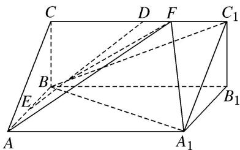
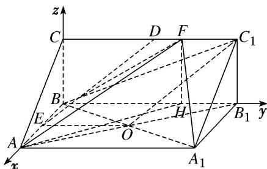

> [!faq]- 《专题12 利用空间向量计算空间角的综合问题-立体几何（理科）》例题解析
>
> > [!success]- **【答案】** 详见解析
>
> > [!note]- **【分析】**
> > 本题未单列分析。
>
> > [!note]- **【解析】**
> > (1)证明： $DE \parallel$ 平面 $C_{1}BA_{1}$ ;
> > (2) $F$ 是线段 $CC_{1}$ 上一点，且直线 $AF$ 与平面 $ABB_{1}A_{1}$ 所成角的正弦值为 $\frac{1}{3}$ ，求二面角 $F - BA_{1} - A$ 的余弦值.
> > 
> > 2. 解析
> > (1)如图, 连接 $AB_{1}$ 交 $A_{1}B$ 于点 $O$ , 连接 $EO$ , $OC_{1}$ .
> > $\because OA = OB_{1}, AE = EB, \therefore OE = \frac{1}{2} BB_{1}, OE \parallel BB_{1}$ , 又 $DC_{1} = \frac{1}{2} BB_{1}, DC_{1} \parallel BB_{1}$ ,
> > ∴OE 綫 $DC_{1}$ ，因此，四边形 $DEOC_{1}$ 为平行四边形，∴ $ED \parallel OC_{1}$ .
> > $\because OC_{1}\subset$ 平面 $C_{1}BA_{1}$ ， $ED\not\subset$ 平面 $C_{1}BA_{1}$ ， $\therefore DE//$ 平面 $C_{1}BA_{1}$ .
> > 
> > (2)易知 AB, $BB_{1}$ , BC 两两垂直,
> > 所以以 BA, $BB_{1}$ , BC 所在直线分别为 x 轴, y 轴, z 轴建立如图所示的空间直角坐标系 B-xyz，过点 F 作 $FH \perp BB_{1}$ ，交 $BB_{1}$ 于点 H，连接 AH.
> > ∵ $BB_{1}$ ⊥ 平面 ABC，AB⊂平面 ABC，∴ $AB \perp BB_{1}$ .
> > ∵ $AB \perp BC$ , $BC \cap BB_{1} = B$ , ∴ $AB \perp$ 平面 $CBB_{1}C_{1}$ .
> > ∵ $AB \subset$ 平面 $BAA_{1}B_{1}$ ，∴ 平面 $BAA_{1}B_{1} \perp$ 平面 $CBB_{1}C_{1}$ .
> > ∵FH⊂平面 $CBB_{1}C_{1}$ ， $FH\perp BB_{1}$ ，平面 $BAA_{1}B_{1}\cap$ 平面 $CBB_{1}C_{1}=BB_{1}$ ，∴FH⊥平面 $BAA_{1}B_{1}$
> > ∴ $\angle FAH$ 为直线 AF 与平面 $ABB_{1}A_{1}$ 所成的角，记为 $\theta$ ，则 $\sin\theta=\frac{FH}{AF}=\frac{1}{3}$ ，∴ AF=3，
> > 在 Rt△ACF 中， $5=AC^{2}=AF^{2}-CF^{2}=9-CF^{2}$ ，∴CF=2，∴ $F(0,2,1)$ ， $A_{1}(2,3,0)$
> > $\therefore \overrightarrow{BF} = (0, 2, 1), \overrightarrow{BA_1} = (2, 3, 0),$
> > 设平面 $BFA_{1}$ 的法向量为 $m=(x, y, z)$ ，则 $\left\{\begin{aligned}&m\cdot\overrightarrow{BF}=2y+z=0,\\ &m\cdot\overrightarrow{BA_{1}}=2x+3y=0,\end{aligned}\right.$ 取 y=2，得 x=-3，z=-4，
> > ∴ $m=(-3,2,-4)$ 为平面 $BFA_{1}$ 的一个法向量．易知平面 $BAA_{1}$ 的一个法向量为 $n=(0,0,1)$ ,
> > 则 $|\cos < m, n > | = \frac{4}{\sqrt{29} \times 1} = \frac{4}{29}\sqrt{29}$ . 又二面角 $F - BA_{1} - A$ 为钝二面角，
> > 因此，二面角 $F - BA_{1} - A$ 的余弦值为 $-\frac{4}{29}\sqrt{29}$ .
