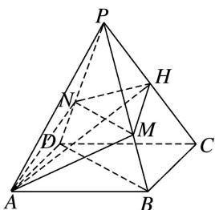
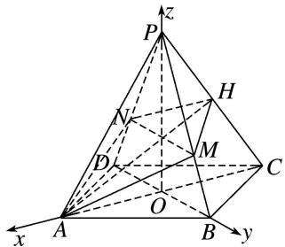

> [!faq]- 《专题12 利用空间向量计算空间角的综合问题-立体几何（理科）》例题解析
>
> > [!success]- **【答案】** 详见解析
>
> > [!note]- **【分析】**
> > 本题未单列分析。
>
> > [!note]- **【解析】**
> > (1)证明： $MN \perp PC;$
> > (2)当 $H$ 为 $PC$ 的中点时， $PA = PC = \sqrt{3} AB, PA$ 与平面ABCD所成的角为 $60^{\circ}$ ，求平面PAB与平面AMHN夹角的余弦值.
> > 
> > 3. 解析
> > (1)如图, 连接 $AC$ 交 $BD$ 于点 $O$ , 连接 $PO$ . 因为四边形 $ABCD$ 为菱形,
> > 所以 $BD \perp AC$ ，且 O 为 AC，BD 的中点，因为 PD = PB，所以 $PO \perp BD$ ，
> > 因为 $AC \cap PO = O$ 且 AC， $PO \subset$ 平面 PAC，所以 $BD \perp$ 平面 PAC，
> > 因为 $PC \subset$ 平面 PAC，所以 $BD \perp PC$ 。因为 $BD \parallel$ 平面 AMHN， $BD \subset$ 平面 PBD，
> > 且平面 $AMHN \cap$ 平面 PBD = MN，所以 BD // MN，所以 $MN \perp PC$ .
> > (2)由
> > (1)知 $BD \perp AC$ 且 $PO \perp BD$ , 因为 $PA = PC$ , 且 $O$ 为 $AC$ 的中点,
> > 所以 $PO \perp AC$ ，所以 $PO \perp$ 平面 ABCD，所以 PA 与平面 ABCD 所成的角为 $\angle PAO$ ，
> > 所以 $AO=\frac{1}{2}PA,\quad PO=\frac{\sqrt{3}}{2}PA$ ，因为 $PA=\sqrt{3}AB$ ，所以 $BO=\frac{\sqrt{3}}{6}PA$ .
> > 分别以 $\overrightarrow{OA},\overrightarrow{OB},\overrightarrow{OP}$ 为x轴，y轴，z轴的正方向，
> > 建立如图所示的空间直角坐标系，设 PA=2，则
> > 
> > $$
> > O (0, 0, 0), A (1, 0, 0), B \left[ 0, \frac {\sqrt {3}}{3}, 0 \right], C (- 1, 0, 0), D \left[ 0, - \frac {\sqrt {3}}{3}, 0 \right], P (0, 0, \sqrt {3}), H \left[ - \frac {1}{2}, 0, \frac {\sqrt {3}}{2} \right],
> > $$
> > $$
> > \overrightarrow {D B} = \left(0, \frac {2 \sqrt {3}}{3}, 0\right), \overrightarrow {A H} = \left(- \frac {3}{2}, 0, \frac {\sqrt {3}}{2}\right), \overrightarrow {A B} = \left(- 1, \frac {\sqrt {3}}{3}, 0\right), \overrightarrow {A P} = (- 1, 0, \sqrt {3}).
> > $$
> > 记平面 AMHN 的一个法向量为 $\boldsymbol{n}_{1}=(x_{1},y_{1},z_{1})$ ,
> > 则 $\left\{ \begin{array}{l} n_{1} \cdot \overrightarrow{DB} = \frac{2\sqrt{3}}{3} y_{1} = 0, \\ n_{1} \cdot \overrightarrow{AH} = -\frac{3}{2} x_{1} + \frac{\sqrt{3}}{2} z_{1} = 0, \end{array} \right.$ 令 $x_{1} = 1$ ，则 $y_{1} = 0$ ， $z_{1} = \sqrt{3}$ ，所以 $n_{1} = (1, 0, \sqrt{3})$
> > 记平面 PAB 的一个法向量为 $\boldsymbol{n}_{2}=(x_{2},y_{2},z_{2})$ ,
> > 则 $\left\{ \begin{array}{l} n_{2} \cdot \overrightarrow{AB} = -x_{2} + \frac{\sqrt{3}}{3} y_{2} = 0, \\ n_{2} \cdot \overrightarrow{AP} = -x_{2} + \sqrt{3} z_{2} = 0, \end{array} \right.$ 令 $x_{2} = 1$ ，则 $y_{2} = \sqrt{3}$ ， $z_{2} = \frac{\sqrt{3}}{3}$ ，所以 $n_{2} = \left(1, \sqrt{3}, \frac{\sqrt{3}}{3}\right)$ ，
> > 记平面 PAB 与平面 AMHN 的夹角为 $\theta$ ，则 $\cos\theta=|\cos<n_{1},\quad n_{2}>|=\frac{n_{1}\cdot n_{2}}{|n_{1}|\cdot|n_{2}|}=\frac{\sqrt{39}}{13}$ .
> > 所以平面 PAB 与平面 AMHN 的夹角的余弦值为 $\frac{\sqrt{39}}{13}$ .
