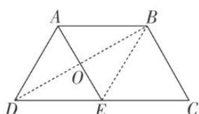
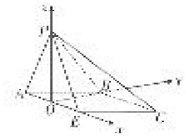

> [!faq]- 《专题12 利用空间向量计算空间角的综合问题-立体几何（理科）》例题解析
>
> > [!success]- **【答案】** A
>
> > [!note]- **【解析】**
> > 解析
> > (1)如图, 连接 $BD$ , $BE$ , 设 $AE$ 的中点为 $O$ ,
> >
> > 
> >
> > ∵ AB // CE, $AB = CE = \frac{1}{2}CD$ , ∴ 四边形 ABCE 为平行四边形,
> >
> > $\therefore AE=BC=AD=DE,\quad\therefore\triangle ADE,\quad\triangle ABE$ 为等边三角形，
> >
> > $\therefore OD \perp AE, OB \perp AE,$ 折叠后 $OP \perp AE, OB \perp AE,$
> >
> > 又 $OP \cap OB = O, \therefore AE \perp$ 平面 POB，又 $PB \subset$ 平面 POB，∴ $AE \perp PB.$
> >
> > (2)在平面 $POB$ 内作 $PQ \perp$ 平面 $ABCE$ , 垂足为 $Q$ , 则 $Q$ 在直线 $OB$ 上,
> >
> > ∴直线 PB 与平面 ABCE 所成的角为 $\angle PBO = \frac{\pi}{4}$ ，又 OP = OB，∴ $OP \perp OB$ ，
> >
> > ∴O, Q两点重合，即PO⊥平面ABCE.
> >
> > 以 O 为坐标原点，OE，OB，OP 所在直线分别为 x 轴、y 轴、z 轴，建立如图所示的空间直角坐标系，
> >
> > 
> >
> > $$
> > \text {则} P \left[ 0, 0, \frac {\sqrt {3}}{2} \right], E \left[ \frac {1}{2}, 0, 0 \right], C \left[ 1, \frac {\sqrt {3}}{2}, 0 \right], \therefore \vec {P E} = \left[ \frac {1}{2}, 0, - \frac {\sqrt {3}}{2} \right], \vec {E C} = \left[ \frac {1}{2}, \frac {\sqrt {3}}{2}, 0 \right],
> > $$
> >
> > 设平面 PCE 的法向量为 $\boldsymbol{n}_{1}=(x,y,z)$ ，则 $\left\{\begin{aligned}\boldsymbol{n}_{1}\cdot\vec{PE}&=0,\\ \boldsymbol{n}_{1}\cdot\vec{EC}&=0,\end{aligned}\right.$ 即 $\left\{\begin{aligned}\frac{1}{2}x-\frac{\sqrt{3}}{2}z&=0,\\ \frac{1}{2}x+\frac{\sqrt{3}}{2}y&=0,\end{aligned}\right.$
> >
> > 令 $x=\sqrt{3}$ 得 $n_{1}=(\sqrt{3}, -1, 1)$ ,
> >
> > 又 OB⊥平面 PAE, ∴ $n_{2}=(0,1,0)$ 为平面 PAE 的一个法向量，
> >
> > 设二面角 A-PE-C 的大小为 $\alpha$ ，则 $|\cos\alpha|=|\cos<n_{1}, n_{2}>|=\frac{|n_{1}\cdot n_{2}|}{|n_{1}||n_{2}|}=\frac{1}{\sqrt{5}}=\frac{\sqrt{5}}{5}$
> >
> > 由图可知二面角 A-PE-C 为钝角，∴ $\cos\alpha=-\frac{\sqrt{5}}{5}$ .
