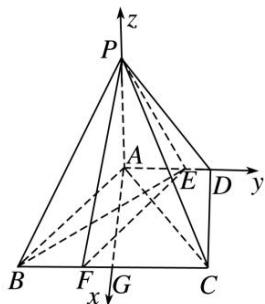

> [!faq]- 《专题12 利用空间向量计算空间角的综合问题-立体几何（理科）》例题解析
>
> > [!success]- **【答案】** C
>
> > [!note]- **【解析】**
> > 解析
> > (1) $\because AB \perp AC, AB = AC, \therefore \angle ACB = 45^{\circ}, \because$ 底面 $ABCD$ 是直角梯形， $\angle ADC = 90^{\circ}, AD \parallel BC,$ $\therefore \angle ACD = 45^{\circ}$ ，即 $AD = CD, AC = \sqrt{2}AD$ ，又 $AB \perp AC, \therefore BC = \sqrt{2}AC = 2AD,$
> >
> > ∵AE=2ED, CF=2FB, ∴AE=BF= $\frac{2}{3}$ AD, 又∵AE//BF,
> >
> > ∴四边形 ABFE 是平行四边形，∴AB∥EF，∴AC⊥EF，
> >
> > ∵ PA⊥底面 ABCD，∴ PA⊥EF，∵ PA∩AC=A，PA，AC⊂平面 PAC，∴ EF⊥平面 PAC，又 EF⊂平面 PEF，∴ 平面 PEF⊥平面 PAC.
> >
> > (2) $\because PA\perp AC, AC\perp AB, PA\cap AB=A, PA, AB\subset$ 平面PAB,
> >
> > ∴ $AC \perp$ 平面 PAB，则 $\angle APC$ 为 PC 与平面 PAB 所成的角，若 PC 与平面 PAB 所成的角为 $45^{\circ}$ ，则 $\tan \angle APC = \frac{AC}{PA} = 1$ ，即 $PA = AC = \sqrt{2}$ ，
> >
> > 
> >
> > 取 BC 的中点 G，连接 AG，则 $AG \perp BC$ ，以 A 为坐标原点，
> >
> > AG, AD, AP 所在直线分别为 x 轴，y 轴，z 轴，建立如图所示的空间直角坐标系 Axyz,
> >
> > 则 $A(0, 0, 0), B(1, -1, 0), C(1, 1, 0), E\left(0, \frac{2}{3}, 0\right), P(0, 0, \sqrt{2})$
> >
> > $$
> > \therefore \overrightarrow {E B} = \left(1, - \frac {5}{3}, 0\right), \overrightarrow {E P} = \left(0, - \frac {2}{3}, \sqrt {2}\right),
> > $$
> >
> > 设平面 PBE 的法向量为 $\boldsymbol{n}=(x,y,z)$ ，则 $\left\{\begin{aligned}\boldsymbol{n}\cdot\overrightarrow{EB}&=0,\\ \boldsymbol{n}\cdot\overrightarrow{EP}&=0,\end{aligned}\right.$ 即 $\left\{\begin{aligned}x-\frac{5}{3}y&=0,\\ -\frac{2}{3}y+\sqrt{2}z&=0,\end{aligned}\right.$
> >
> > 令 $y = 3$ ，则 $x = 5$ ， $z = \sqrt{2}$ ， $\therefore n = (5,3,\sqrt{2})$ . $\because \overrightarrow{AC} = (1,1,0)$ 是平面PAB的一个法向量， $\cos < n$ ， $\overrightarrow{AC} > = \frac{5 + 3}{\sqrt{2} \times 6} = \frac{2\sqrt{2}}{3},$
> >
> > 即当二面角 A—PB—E 的余弦值为 $\frac{2\sqrt{2}}{3}$ 时，直线 PC 与平面 PAB 所成的角为 $45^{\circ}$ .
