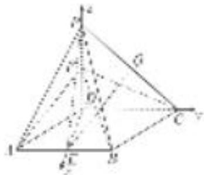

> [!faq]- 《专题12 利用空间向量计算空间角的综合问题-立体几何（理科）》例题解析
>
> > [!success]- **【答案】** B
>
> > [!note]- **【解析】**
> > 解析
> > (1)在棱 $AB$ 上存在点 $E$ , 使得 $AF \parallel$ 平面 $PCE$ , 点 $E$ 为棱 $AB$ 的中点. 理由如下: 取 $PC$ 的中点 $Q$ , 连接 $EQ$ , $FQ$ ,
> >
> > 由题意， $FQ \parallel DC$ 且 $FQ = \frac{1}{2} CD$ ， $AE \parallel CD$ 且 $AE = \frac{1}{2} CD$ ，则 $AE \parallel FQ$ 且 AE = FQ。
> >
> > 所以四边形 $AEQF$ 为平行四边形．所以 $AF \parallel EQ$ ，又 $EQ \subset$ 平面 $PCE$ ， $AF \nmid$ 平面 $PCE$ ，所以 $AF \parallel$ 平面 $PCE$ .
> >
> > (2)由题意，知 $\triangle ABD$ 为正三角形，所以 $ED\perp AB$ ，亦即 $ED\perp CD$ ，
> >
> > 又 $\angle ADP=90^{\circ}$ ，所以 $PD\perp AD$ ，且平面 $ADP\perp$ 平面 $ABCD$ ，平面 $ADP\cap$ 平面 $ABCD=AD$ ，
> >
> > 
> >
> > 所以 $PD \perp$ 平面 ABCD，故以 D 为坐标原点建立如图所示的空间直角坐标系，
> >
> > 设 $FD=a(a>0)$ ，则由题意知 $D(0,0,0)$ ， $F(0,0,a)$ ， $C(0,2,0)$ ， $B(\sqrt{3},1,0)$ ， $\vec{FC}=(0,2,-a)$ ， $\vec{CB}=(\sqrt{3},-1,0)$ ，
> >
> > 设平面 FBC 的法向量为 $\boldsymbol{m}=(x,y,z)$ ，则由 $\left\{\begin{aligned}\boldsymbol{m}\cdot\overrightarrow{FC}&=0,\\ \boldsymbol{m}\cdot\overrightarrow{CB}&=0,\end{aligned}\right.$ 得 $\left\{\begin{aligned}2y-az&=0,\\ \sqrt{3}x-y&=0,\end{aligned}\right.$
> >
> > 令 x=1，则 $y=\sqrt{3}$ ， $z=\frac{2\sqrt{3}}{a}$ ，所以取 $m=\left(1,\sqrt{3},\frac{2\sqrt{3}}{a}\right)$ ,
> >
> > 显然可取平面 DFC 的法向量 $n=(1,0,0)$ ,
> >
> > 由题意知 $\frac{\sqrt{2}}{4} = |\cos < m, n > | = \frac{1}{\sqrt{1 + 3 + \frac{12}{a^2}}}$ ，所以 $a = \sqrt{3}$ .
> >
> > 由于 $PD \perp$ 平面 ABCD，所以 PB 在平面 ABCD 内的射影为 BD，所以 $\angle PBD$ 为直线 PB 与平面 ABCD 所成的角，
> >
> > 易知在 Rt△PBD 中， $\tan\angle PBD=\frac{PD}{BD}=a=\sqrt{3}$ ，从而 $\angle PBD=60^{\circ}$
> >
> > 所以直线 PB 与平面 ABCD 所成的角为 $60^{\circ}$ .
