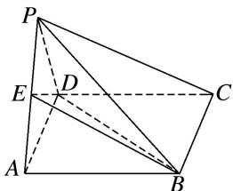

<!-- question-source:start -->
[例 5] 如图，在四棱锥 P-ABCD 中，底面 ABCD 为矩形，点 E 在线段 PA 上，PC// 平面 BDE.

(1)请确定点 E 的位置，并说明理由；

(2)若 $\triangle PAD$ 是等边三角形， $AB = 2AD$ ，平面 $PAD\bot$ 平面 $ABCD$ ，四棱锥 $P - ABCD$ 的体积为 $9\sqrt{3}$ ，求点 $E$ 到平面 $PCD$ 的距离.

<!-- question-source:end -->

![[高中/总复习/专题/立体几何/专题13 利用空间向量计算距离的问题-立体几何（理科）/专题13_利用空间向量计算距离的问题/例题/answers/Q00043806A1.md]]
