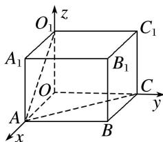
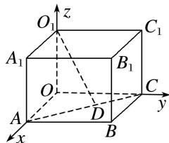

> [!faq]- 《专题13 利用空间向量计算距离的问题-立体几何（理科）》例题解析
>
> > [!success]- **【答案】** 详见解析
>
> > [!note]- **【解析】**
> > 解析 方法一 连接 $AO_{1}$ ，建立如图所示的空间直角坐标系，
> >
> > 
> >
> > 则 $A(2, 0, 0)$ ， $O_{1}(0, 0, 2)$ ， $C(0, 3, 0)$ ， $\therefore \overrightarrow{AO}_{1}=(-2, 0, 2)$ ， $\overrightarrow{AC}=(-2, 3, 0)$ ，
> >
> > $\therefore a = \overrightarrow{AO_1} = (-2, 0, 2), a^2 = 8, u = \frac{\overrightarrow{AC}}{|\overrightarrow{AC}|} = \left[\frac{-2}{\sqrt{13}}, \frac{3}{\sqrt{13}}, 0\right], a u = \frac{4}{\sqrt{13}}.$
> >
> > ∴ $O_{1}$ 到直线 AC 的距离 $d=\sqrt{a^{2}-(a\cdot u)^{2}}=\frac{2\sqrt{286}}{13}$ .
> >
> > 方法二 建立如图所示的空间直角坐标系，则 $A(2, 0, 0)$ ， $O_{1}(0, 0, 2)$ ， $C(0, 3, 0)$ ，
> >
> > 过 $O_{1}$ 作 $O_{1}D \perp AC$ 于点 D，设 $D(x, y, 0)$ ，则 $\overrightarrow{O_{1}D} = (x, y, -2)$ ， $\overrightarrow{AD} = (x - 2, y, 0)$ .
> >
> > 
> >
> > $\because \overrightarrow{AC} = (-2, 3, 0), \overrightarrow{O_1D} \perp \overrightarrow{AC}, \overrightarrow{AD} // \overrightarrow{AC}, \therefore \begin{cases} -2x + 3y = 0, \\ x - 2 = y \\ -2 = 3, \end{cases}$ 解得 $\left\{ \begin{array}{l} x = \frac{18}{13}, \\ y = \frac{12}{13}, \end{array} \right.$ $\therefore D\left( \begin{array}{lll} \frac{18}{13}, & \frac{12}{13}, & 0 \end{array} \right),$
> >
> > $\therefore |\overrightarrow{O_1D}| = \sqrt{\left(\frac{18}{13}\right)^2 + \left(\frac{12}{13}\right)^2 + (-2)^2} = \frac{2\sqrt{286}}{13}$ . 即 $O_1$ 到直线 $AC$ 的距离为 $\frac{2\sqrt{286}}{13}$ .
