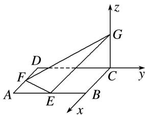

> [!faq]- 《专题13 利用空间向量计算距离的问题-立体几何（理科）》例题解析
>
> > [!success]- **【答案】** 详见解析
>
> > [!note]- **【分析】**
> > 本题未单列分析。
>
> > [!note]- **【解析】**
> > 解析 建立如图所示的空间直角坐标系 Cxyz，则 $G(0, 0, 2)$ ， $E(4, -2, 0)$ ， $F(2, -4, 0)$ ， $B(4, 0, 0)$ ， $\therefore \vec{GE} = (4, -2, -2)$ ， $\vec{GF} = (2, -4, -2)$ ， $\vec{BE} = (0, -2, 0)$ .
> > 
> > 设平面 EFG 的法向量为 $\boldsymbol{n}=(x,y,z)$ . 由 $\left\{\begin{aligned}\vec{GE}\cdot\boldsymbol{n}&=0,\\ \vec{GF}\cdot\boldsymbol{n}&=0,\end{aligned}\right.$ 得 $\left\{\begin{aligned}2x-y-z&=0,\\ x-2y-z&=0,\end{aligned}\right.$
> > ∴x=-y, z=-3y. 取 y=1，则 $n=(-1,1,-3)$ .
> > ∴点 B 到平面 EFG 的距离 $d=\frac{|\overrightarrow{BE}\cdot\boldsymbol{n}|}{|\boldsymbol{n}|}=\frac{2}{\sqrt{11}}=\frac{2\sqrt{11}}{11}$ .
