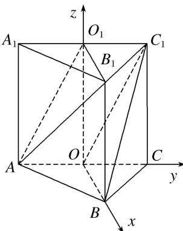

> [!faq]- 《专题13 利用空间向量计算距离的问题-立体几何（理科）》例题解析
>
> > [!success]- **【答案】** 详见解析
>
> > [!note]- **【分析】**
> > 本题未单列分析。
>
> > [!note]- **【解析】**
> > 解析 如图，连接 $OO_{1}$ ，根据题意， $OO_{1} \perp$ 底面 ABC，
> >
> > 
> >
> > 则以 O 为原点，分别以 OB, OC, $OO_{1}$ 所在的直线为 x, y, z 轴建立空间直角坐标系.
> >
> > $\because AO_{1} \parallel OC_{1}, OB \parallel O_{1}B_{1}, AO_{1} \cap O_{1}B_{1}=O_{1}, OC_{1} \cap OB=O, \therefore$ 平面 $AB_{1}O_{1} \parallel$ 平面 $BC_{1}O.$
> >
> > ∴平面 $AB_{1}O_{1}$ 与平面 $BC_{1}O$ 间的距离即为点 $O_{1}$ 到平面 $BC_{1}O$ 的距离.
> >
> > $\because O(0, 0, 0), B(\sqrt{3}, 0, 0), C_1(0, 1, 2), O_1(0, 0, 2)$
> >
> > $\therefore \overrightarrow{OB} = (\sqrt{3}, 0, 0), \overrightarrow{OC_1} = (0, 1, 2), \overrightarrow{OO_1} = (0, 0, 2),$
> >
> > 设 $\boldsymbol{n}=(x,y,z)$ 为平面 $BC_{1}O$ 的法向量，则 $\left\{\begin{aligned}\boldsymbol{n}\cdot\overrightarrow{OB}&=0,\\ \boldsymbol{n}\cdot\overrightarrow{OC}_{1}&=0,\end{aligned}\right.$ 即 $\left\{\begin{aligned}x&=0,\\ y&+2z=0,\end{aligned}\right.$ $\therefore$ 可取 $\boldsymbol{n}=(0,2,-1)$ .
> >
> > 点 $O_{1}$ 到平面 $BC_{1}O$ 的距离记为 $d$ ，则 $d = \frac{|n \cdot \overrightarrow{OO_1}|}{|n|} = \frac{2}{\sqrt{5}} = \frac{2\sqrt{5}}{5}$ .
> >
> > ∴平面 $AB_{1}O_{1}$ 与平面 $BC_{1}O$ 间的距离为 $\frac{2\sqrt{5}}{5}$ .
