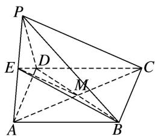
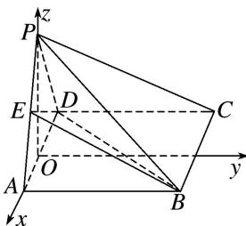

> [!faq]- 《专题13 利用空间向量计算距离的问题-立体几何（理科）》例题解析
>
> > [!success]- **【答案】** 详见解析
>
> > [!note]- **【解析】**
> > 解析
> > (1)连接 AC 交 BD 于 M，连接 EM，如图，当 E 为 AP 的中点时，点 M 为 AC 的中点.
> >
> > 
> >
> > ∴在△APC中， $EM \parallel PC$ ， $EM \subset$ 平面BDE， $PC \not\subset$ 平面BDE．∴PC//平面BDE.
> >
> > (2) $\because \triangle PAD$ 是等边三角形，AB=2AD，平面PAD⊥平面ABCD，
> >
> > ∴以 AD 的中点 O 为原点，OA 为 x 轴，在矩形 ABCD 中，过点 O 作 AB 的平行线为 y 轴，以 OP 为 z 轴，建立空间直角坐标系，设 AD = x，
> >
> > 
> >
> > ∵四棱锥 P-ABCD 的体积为 $9\sqrt{3}$ ，∴ $\frac{1}{3}x \cdot 2x \cdot \sqrt{x^{2} - \left(\frac{x}{2}\right)^{2}} = 9\sqrt{3}$ ，解得 x = 3，
> >
> > $\therefore A\left[\frac{3}{2}, 0, 0\right], P\left[0, 0, \frac{3\sqrt{3}}{2}\right], E\left[\frac{3}{4}, 0, \frac{3\sqrt{3}}{4}\right], D\left[-\frac{3}{2}, 0, 0\right], C\left[-\frac{3}{2}, 6, 0\right]. \vec{PE} = \left[\frac{3}{4}, 0, -\frac{3\sqrt{3}}{4}\right],$ $\vec{PC} = \left[-\frac{3}{2}, 6, -\frac{3\sqrt{3}}{2}\right], \vec{PD} = \left[-\frac{3}{2}, 0, -\frac{3\sqrt{3}}{2}\right],$
> >
> > 设平面 PCD 的一个法向量为 $\boldsymbol{n}=(x,y,z)$ ，则 $\left\{\begin{aligned}\boldsymbol{n}\cdot\overrightarrow{PC}&=-\frac{3}{2}x+6y-\frac{3\sqrt{3}}{2}z=0,\\ \boldsymbol{n}\cdot\overrightarrow{PD}&=-\frac{3}{2}x-\frac{3\sqrt{3}}{2}z=0,\end{aligned}\right.$ 取 $x=\sqrt{3}$ ,
> >
> > 得 $\boldsymbol{n}=(\sqrt{3},0,-1)$ ，∴ E 到平面 PCD 的距离 $d=\frac{|\overrightarrow{PE}\cdot\boldsymbol{n}|}{|\boldsymbol{n}|}=\frac{\frac{3\sqrt{3}}{2}}{2}=\frac{3\sqrt{3}}{4}$ .
> >
> > ## 【对点训练】
