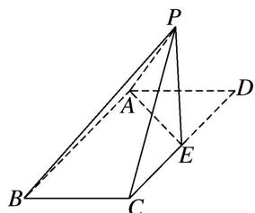

<!-- question-source:start -->
7. 如图所示，在平行四边形 ABCD 中，AB=4， $BC=2\sqrt{2}$ ， $\angle ABC=45^{\circ}$ ，点 E 是 CD 边的中点，将 $\triangle DAE$ 沿 AE 折起，使点 D 到达点 P 的位置，且 $PB=2\sqrt{6}$ .

(1)求证：平面 $PAE \perp$ 平面 ABCE;

(2)求点 E 到平面 PAB 的距离.

<!-- question-source:end -->

![[高中/总复习/专题/立体几何/专题13 利用空间向量计算距离的问题-立体几何（理科）/专题13_利用空间向量计算距离的问题/对点训练/answers/Q00043807A1.md]]
