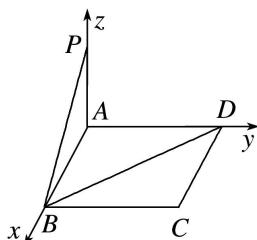

> [!faq]- 《专题13 利用空间向量计算距离的问题-立体几何（理科）》例题解析
>
> > [!success]- **【答案】** 详见解析
>
> > [!note]- **【分析】**
> > 本题未单列分析。
>
> > [!note]- **【解析】**
> > 解析 如图，分别以 AB, AD, AP 所在直线为 x, y, z 轴建立空间直角坐标系，则 $P(0, 0, 1)$ ， $B(3, 0, 0)$ ， $D(0, 4, 0)$ ，
> >
> > 
> >
> > $\therefore \overrightarrow{PB} = (3, 0, -1), \overrightarrow{BD} = (-3, 4, 0)$ ，取 $a = \overrightarrow{PB} = (3, 0, -1)$ ， $m = \frac{\overrightarrow{BD}}{|\overrightarrow{BD}|} = \left(-\frac{3}{5}, \frac{4}{5}, 0\right)$ ，
> >
> > 则 $a^{2}=10,\quad a\cdot m=-\frac{9}{5}$ ，所以点 P 到 BD 的距离为 $\sqrt{a^{2}-(a\cdot m)^{2}}=\sqrt{10-\frac{81}{25}}=\frac{13}{5}$ .
