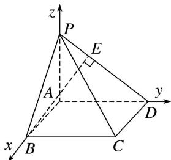

> [!faq]- 《专题13 利用空间向量计算距离的问题-立体几何（理科）》例题解析
>
> > [!success]- **【答案】** 详见解析
>
> > [!note]- **【分析】**
> > 本题未单列分析。
>
> > [!note]- **【解析】**
> > 解析 $\because PA \perp$ 平面 $ABCD$ , $\therefore \angle PDA$ 即为 $PD$ 与平面 $ABCD$ 所成的角, $\therefore \angle PDA = 45^{\circ}$ ,
> >
> > $\therefore PA=AD=4,\ AB=2.$
> >
> > 以 A 为原点，AB，AD，AP 所在直线分别为 x 轴，y 轴，z 轴建立空间直角坐标系，如图所示.
> >
> > 
> >
> > $\therefore A(0, 0, 0), B(2, 0, 0), P(0, 0, 4), D(0, 4, 0), \overrightarrow{DP} = (0, -4, 4).$
> >
> > 方法一 设存在点 E，使 $\overrightarrow{DE} = \lambda \overrightarrow{DP}$ ，且 $BE \perp DP$ ，设 $E(x, y, z)$ ,
> >
> > $\therefore (x, y - 4, z) = \lambda(0, -4, 4), \therefore x = 0, y = 4 - 4\lambda, z = 4\lambda,$
> >
> > ∴ 点 $E(0, 4-4\lambda, 4\lambda)$ ， $\vec{BE}=(-2, 4-4\lambda, 4\lambda)$ .
> >
> > $\because BE \perp DP, \therefore \overrightarrow{BE} \cdot \overrightarrow{DP} = -4(4 - 4\lambda) + 4 \times 4\lambda = 0,$ 解得 $\lambda = \frac{1}{2}$ .
> >
> > $\therefore \overrightarrow{BE} = (-2, 2, 2), \therefore |\overrightarrow{BE}| = \sqrt{4 + 4 + 4} = 2\sqrt{3}$ ，故点 $B$ 到直线 $PD$ 的距离为 $2\sqrt{3}$ .
> >
> > 方法二 $\vec{BP}=(-2,0,4)$ ， $\vec{DP}=(0,-4,4)$ ，∴ $\vec{BP}\cdot\vec{DP}=16$
> >
> > ∴ $\overrightarrow{BP}$ 在 $\overrightarrow{DP}$ 上的投影向量的长度为 $\frac{|\overrightarrow{BP}\cdot\overrightarrow{DP}|}{|\overrightarrow{DP}|}=\frac{16}{\sqrt{16+16}}=2\sqrt{2}.$
> >
> > 所以点 B 到直线 PD 的距离为 $d=\sqrt{|\overrightarrow{BP}|^{2}-(2\sqrt{2})^{2}}=\sqrt{20-8}=2\sqrt{3}$ .
