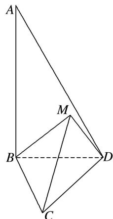
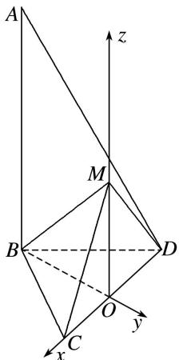
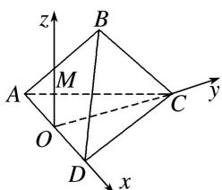

> [!faq]- 《专题13 利用空间向量计算距离的问题-立体几何（理科）》例题解析
>
> > [!success]- **【答案】** 详见解析
>
> > [!note]- **【分析】**
> > 本题未单列分析。
>
> > [!note]- **【解析】**
> > 解析 如图，取 CD 的中点 O，连接 OB，OM，
> > 
> > 
> > 因为 $\triangle BCD$ 与 $\triangle MCD$ 均为正三角形，所以 $OB \perp CD$ ， $OM \perp CD$ ，
> > 又平面 $MCD \perp$ 平面 $BCD$ ，平面 $MCD \cap$ 平面 $BCD = CD$ ， $OM \subset$ 平面 $MCD$ ，所以 $MO \perp$ 平面 $BCD$ .
> > 以 $O$ 为坐标原点，直线 $OC$ ， $BO$ ， $OM$ 分别为 $x$ 轴， $y$ 轴， $z$ 轴，建立空间直角坐标系 $Oxyz$ .
> > 因为 $\triangle BCD$ 与 $\triangle MCD$ 都是边长为 2 的正三角形，所以 $OB = OM = \sqrt{3}$ ,
> > 则 $O(0, 0, 0)$ ， $C(1, 0, 0)$ ， $M(0, 0, \sqrt{3})$ ， $B(0, -\sqrt{3}, 0)$ ， $A(0, -\sqrt{3}, 2\sqrt{3})$ ,
> > 所以 $\overrightarrow{BC} = (1, \sqrt{3}, 0)$ 。 $\overrightarrow{BM} = (0, \sqrt{3}, \sqrt{3})$ .
> > 设平面 $MBC$ 的法向量为 $n = (x, y, z)$ ，由 $\left\{ \begin{array}{l} n \perp \overrightarrow{BC}, \\ n \perp \overrightarrow{BM}, \end{array} \right.$ 得 $\left\{ \begin{array}{l} n \cdot \overrightarrow{BC} = 0, \\ n \cdot \overrightarrow{BM} = 0, \end{array} \right.$ 即 $\left\{ \begin{array}{l} x + \sqrt{3}y = 0, \\ \sqrt{3}y + \sqrt{3}z = 0, \end{array} \right.$ 取 $x = \sqrt{3}$ ，可得平面 $MBC$ 的一个法向量为 $n = (\sqrt{3}, -1, 1)$ 。又 $\overrightarrow{BA} = (0, 0, 2\sqrt{3})$ ,
> > 所以所求距离为 $d = \frac{|\overrightarrow{BA} \cdot n|}{|n|} = \frac{2\sqrt{15}}{5}$ .
> > 在三棱锥 $B-ACD$ 中，平面 $ABD \perp$ 平面 $ACD$ ，若棱长 $AC = CD = AD = AB = 1$ ，且 $\angle BAD = 30^\circ$ ，求点 $D$ 到平面 $ABC$ 的距离.
> > 4. 解析 如图所示，以 $AD$ 的中点 $O$ 为原点，以 $OD$ ， $OC$ 所在直线为 $x$ 轴、 $y$ 轴，过 $O$ 作 $OM \perp$ 平面 $ACD$ 交 $AB$ 于 $M$ ，以直线 $OM$ 为 $z$ 轴建立空间直角坐标系，
> > 
> > 则 $A\left(-\frac{1}{2}, 0, 0\right), B\left(\frac{\sqrt{3} - 1}{2}, 0, \frac{1}{2}\right), C\left(0, \frac{\sqrt{3}}{2}, 0\right), D\left(\frac{1}{2}, 0, 0\right),$ $\therefore \overrightarrow{AC} = \left(\frac{1}{2}, \frac{\sqrt{3}}{2}, 0\right), \overrightarrow{AB} = \left(\frac{\sqrt{3}}{2}, 0, \frac{1}{2}\right), \overrightarrow{DC} = \left(-\frac{1}{2}, \frac{\sqrt{3}}{2}, 0\right),$ 设 $\pmb{n} = (x, y, z)$ 为平面 $ABC$ 的一个法向量，则 $\begin{cases} n \cdot \overrightarrow{AB} = \frac{\sqrt{3}}{2} x + \frac{1}{2} z = 0, \\ n \cdot \overrightarrow{AC} = \frac{1}{2} x + \frac{\sqrt{3}}{2} y = 0, \end{cases}$ $\therefore y = -\frac{\sqrt{3}}{3} x, z = -\sqrt{3} x$ ，可取 $n = (-\sqrt{3}, 1, 3)$ ，代入 $d = \frac{|\vec{D}C \cdot n|}{|n|}$ ，得 $d = \frac{\frac{\sqrt{3}}{2} + \frac{\sqrt{3}}{2}}{\sqrt{13}} = \frac{\sqrt{39}}{13}$ ，即点 $D$ 到平面 $ABC$ 的距离是 $\frac{\sqrt{39}}{13}$ .
