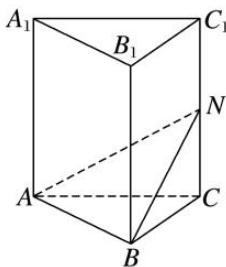
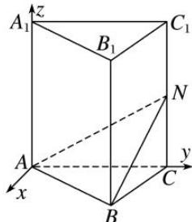

> [!faq]- 《专题13 利用空间向量计算距离的问题-立体几何（理科）》例题解析
>
> > [!success]- **【答案】** 详见解析
>
> > [!note]- **【分析】**
> > 本题未单列分析。
>
> > [!note]- **【解析】**
> > (1)求点 N 到直线 AB 的距离;
> > (2)求点 $C_1$ 到平面 $ABN$ 的距离.
> > 
> > 5. 解析 建立如图所示的空间直角坐标系，则 $A(0, 0, 0)$ ， $B(2\sqrt{3}, 2, 0)$ ， $C(0, 4, 0)$ ， $C_{1}(0, 4, 4)$ ，
> > 
> > ∵N是 $CC_{1}$ 的中点，∴ $N(0,4,2)$ .
> > (1) $\overrightarrow{AN}=(0,4,2)$ ， $\overrightarrow{AB}=(2\sqrt{3},2,0)$ ，则 $|\overrightarrow{AN}|=2\sqrt{5}$ ， $|\overrightarrow{AB}|=4$ 。设点N到直线AB的距离为 $d_{1}$ ，
> > 则 $d_{1} = \sqrt{|\overrightarrow{AN}|^{2} - \left(\frac{\overrightarrow{AN}\cdot\overrightarrow{AB}}{|\overrightarrow{AB}|}\right)^{2}} = \sqrt{20 - 4} = 4.$
> > (2)设平面 ABN 的一个法向量为 $\boldsymbol{n}=(x,y,z)$ ，则由 $n\perp\overrightarrow{AB}, n\perp\overrightarrow{AN}$ ,
> > 得 $\left\{ \begin{array}{l} n \cdot \overrightarrow{AB} = 2\sqrt{3} x + 2y = 0, \\ n \cdot \overrightarrow{AN} = 4y + 2z = 0, \end{array} \right.$ 令 $z = 2$ ，则 $y = -1$ ， $x = \frac{\sqrt{3}}{3}$ ，即 $n = \left[\frac{\sqrt{3}}{3}, -1, 2\right]$ .
> > 易知 $\overrightarrow{C_1N} = (0, 0, -2)$ ，设点 $C_1$ 到平面 $ABN$ 的距离为 $d_2$ ，则 $d_2 = \left|\frac{\overrightarrow{C_1N}\cdot n}{|n|}\right| = \left|\frac{-4}{\frac{4\sqrt{3}}{3}}\right| = \sqrt{3}$ .
