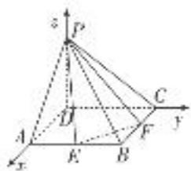

> [!faq]- 《专题13 利用空间向量计算距离的问题-立体几何（理科）》例题解析
>
> > [!success]- **【答案】** 详见解析
>
> > [!note]- **【分析】**
> > 本题未单列分析。
>
> > [!note]- **【解析】**
> > (1)求点 D 到平面 PEF 的距离;
> > (2)求直线 AC 到平面 PEF 的距离.
> > 6. 解析 建立如图所示的空间直角坐标系，则 $P(0, 0, 1)$ , $A(1, 0, 0)$ , $C(0, 1, 0)$ , $E\left(1, \frac{1}{2}, 0\right)$ , $F\left(\frac{1}{2}, 1, 0\right)$ .
> > 
> > (1)设 $DH \perp$ 平面 $PEF$ ，垂足为 $H$ ，则 $\overrightarrow{DH} = x\overrightarrow{DE} + y\overrightarrow{DF} + z\overrightarrow{DP} = \left(x + \frac{1}{2}y, \frac{1}{2}x + y, z\right)$ ，其中 $x + y + z = 1$ .
> > 因为 $\vec{PE}=\left(1,\frac{1}{2},-1\right)$ ， $\vec{PF}=\left(\frac{1}{2},1,-1\right)$ ,
> > 所以 $\overrightarrow{DH}\cdot\overrightarrow{PE}=x+\frac{1}{2}y+\frac{1}{2}\left(\frac{1}{2}x+y\right)-z=\frac{5}{4}x+y-z=0.$
> > 同理， $x+\frac{5}{4}y-z=0$ 。又 $x+y+z=1$ ，由此解得 $x=y=\frac{4}{17}$ ， $z=\frac{9}{17}$ 。
> > 所以 $\overrightarrow{DH} = \left[\frac{6}{17},\frac{6}{17},\frac{9}{17}\right] = \frac{3}{17}(2,2,3)$ 所以 $|\overrightarrow{DH}| = \frac{3\sqrt{17}}{17}$
> > 即点 D 到平面 PEF 的距离为 $\frac{3\sqrt{17}}{17}$ .
> > (2)设 $AH' \perp$ 平面 PEF，垂足为 $H'$ ，则 $\overrightarrow{AH}' \parallel \overrightarrow{DH}$ .
> > 设 $\overrightarrow{AH'}=\lambda(2,2,3)=(2\lambda,2\lambda,3\lambda)(\lambda\neq0)$ ，则
> > $$
> > \overrightarrow {E H ^ {\prime}} = \overrightarrow {E A} + A \overrightarrow {H ^ {\prime}} = \left(0, - \frac {1}{2}, 0\right) + (2 \lambda , 2 \lambda , 3 \lambda) = \left(2 \lambda , 2 \lambda - \frac {1}{2}, 3 \lambda\right).
> > $$
> > 所以 $\overrightarrow{AH'}\cdot\overrightarrow{EH'}=4\lambda^{2}+4\lambda^{2}-\lambda+9\lambda^{2}=0$ ，即 $\lambda=\frac{1}{17}$ .
> > 所以 $\overrightarrow{AH'}=\left(\frac{2}{17},\quad\frac{2}{17},\quad\frac{3}{17}\right)=\frac{1}{17}(2,\quad2,\quad3)$ ，所以 $|\overrightarrow{AH'}|=\frac{\sqrt{17}}{17}$ .
> > 而直线 $AC / /$ 平面PEF，所以直线 $AC$ 到平面PEF的距离为 $\frac{\sqrt{17}}{17}$
