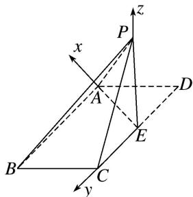

> [!faq]- 《专题13 利用空间向量计算距离的问题-立体几何（理科）》例题解析
>
> > [!success]- **【答案】** 详见解析
>
> > [!note]- **【解析】**
> > 解析
> > (1)∵在平行四边形ABCD中，AB=4， $BC=2\sqrt{2}$ ， $\angle ABC=45^{\circ}$
> >
> > 点 E 是 CD 边的中点，将 $\triangle DAE$ 沿 AE 折起，使点 D 到达点 P 的位置，且 $PB = 2\sqrt{6}$ .
> >
> > $$
> > \therefore A E = \sqrt {(2 \sqrt {2}) ^ {2} + 2 ^ {2} - 2 \times 2 \sqrt {2} \times 2 \times \cos 4 5 ^ {\circ}} = 2, \quad \therefore A E \perp A B,
> > $$
> >
> > $\because AB^{2}+PA^{2}=PB^{2},\therefore AB\perp PA,\because AE\cap PA=A,AE,PA\subset$ 平面PAE, $\therefore AB\perp$ 平面PAE,
> >
> > ∵AB⊂平面ABCE，∴平面PAE⊥平面ABCE.
> >
> > (2) $\because AE=2,\ DE=2,\ PA=2\sqrt{2},\ \therefore PA^{2}=AE^{2}+PE^{2},\ \therefore AE\perp PE,\ \because AB\perp$ 平面PAE, $AB\parallel CE,$
> >
> > ∴ CE ⊥ 平面 PAE, ∴ EA, EC, EP 两两垂直，以 E 为原点，EA, EC, EP 为 x 轴，y 轴，z 轴，建立空间直角坐标系，则 $E(0, 0, 0)$ , $A(2, 0, 0)$ , $B(2, 4, 0)$ , $P(0, 0, 2)$ ,
> >
> > 
> >
> > $$
> > \vec {P E} = (0, 0, - 2), \vec {P A} = (2, 0, - 2), \vec {P B} = (2, 4, - 2).
> > $$
> >
> > 设平面 PAB 的一个法向量为 $\boldsymbol{n}=(x,y,z)$ ，则 $\left\{\begin{aligned}\boldsymbol{n}\cdot\overrightarrow{PA}&=2x-2z=0,\\ \boldsymbol{n}\cdot\overrightarrow{PB}&=2x+4y-2z=0,\end{aligned}\right.$ 取 x=1，得 $\boldsymbol{n}=(1,0,1)$ ，
> > ∴点E到平面PAB的距离 $d=\frac{|PE\cdot n|}{|n|}=\frac{2}{\sqrt{2}}=\sqrt{2}$ .
