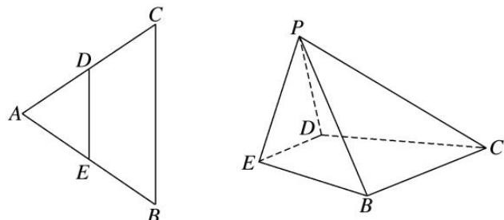
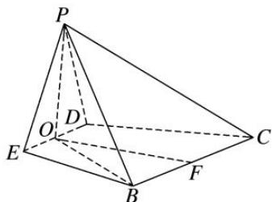
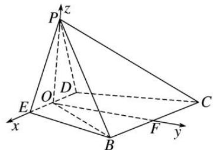
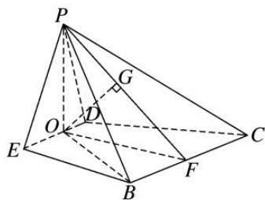

> [!faq]- 《专题13 利用空间向量计算距离的问题-立体几何（理科）》例题解析
>
> > [!success]- **【答案】** 详见解析
>
> > [!note]- **【分析】**
> > 本题未单列分析。
>
> > [!note]- **【解析】**
> > (1)求 $PB$ 与平面 $BCDE$ 所成角的正弦值;
> > (2)求直线 DE 到平面 PBC 的距离.
> > 
> > 8. 解析
> > (1)如图所示, 设 $DE$ 的中点为 $O$ , $BC$ 的中点为 $F$ , 连接 $OP$ , $OF$ , $OB$ , 则 $OP \perp DE$ .
> > 
> > 因为平面 $PDE \perp$ 平面 BCDE，平面 $PDE \cap$ 平面 $BCDE = DE$ ， $OP \subset$ 平面 PDE，所以 $OP \perp$ 平面 BCDE。因为 $OB \subset$ 平面 BCDE，所以 $OP \perp OB$ ，所以 $\angle OBP$ 即为直线 PB 与平面 BCDE 所成的角。
> > 因为 $BC = 4$ ，则 $DE = \frac{1}{2} BC = 2$ ，所以 $OP = OF = \sqrt{3}$
> > 在 Rt△OBF 中， $BF=2,\ OF\perp BF$ ，所以 $OB=\sqrt{7}$ .
> > 在 Rt△OBP 中， $PB=\sqrt{OP^{2}+OB^{2}}=\sqrt{3+7}=\sqrt{10}$
> > 所以 $\sin \angle OBP = \frac{OP}{PB} = \frac{\sqrt{3}}{\sqrt{10}} = \frac{\sqrt{30}}{10}$ .
> > (2)方法一 因为点 D, E 分别为 AC, AB 边的中点，所以 DE // BC.
> > 因为 $DE \not\subset$ 平面 PBC， $BC \subset$ 平面 PBC，所以 $DE \parallel$ 平面 PBC.
> > 由
> > (1)知， $OP \perp$ 平面 BCDE，又 $OF \perp DE$ ，
> > 所以以点 O 为坐标原点，OE，OF，OP 所在直线为 x 轴，y 轴，z 轴建立如图所示的空间直角坐标系，
> > 
> > 则 $O(0, 0, 0)$ ， $P(0, 0, \sqrt{3})$ ， $B(2, \sqrt{3}, 0)$ ， $C(-2, \sqrt{3}, 0)$ ， $F(0, \sqrt{3}, 0)$ ，
> > 所以 $\vec{PB} = (2, \sqrt{3}, -\sqrt{3})$ ， $\vec{CB} = (4, 0, 0)$ .
> > 设平面 PBC 的一个法向量为 $\boldsymbol{n}=(x,y,z)$ ，由 $\left\{\begin{aligned}\boldsymbol{n}\cdot\overrightarrow{PB}&=2x+\sqrt{3}y-\sqrt{3}z=0,\\ \boldsymbol{n}\cdot\overrightarrow{CB}&=4x=0,\end{aligned}\right.$ 得 $\left\{\begin{aligned}x&=0,\\ y&=z,\end{aligned}\right.$
> > 令 y=z=1，所以 $n=(0,1,1)$ .
> > 因为 $\overrightarrow{OF}=(0,\sqrt{3},0)$ ，设点 O 到平面 PBC 的距离为 d，
> > 则 $d = \frac{|\overrightarrow{OF} \cdot \boldsymbol{n}|}{|\boldsymbol{n}|} = \frac{\sqrt{3}}{\sqrt{2}} = \frac{\sqrt{6}}{2}$ . 因为点 $O$ 在直线 $DE$ 上，所以直线 $DE$ 到平面 $PBC$ 的距离等于 $\frac{\sqrt{6}}{2}$ .
> > 方法二 如图，连接 PF，因为点 D，E 分别为 AC，AB 边的中点，所以 DE // BC.
> > 
> > 因为 $DE \not\subset$ 平面 PBC， $BC \subset$ 平面 PBC，所以 $DE \parallel$ 平面 PBC.
> > 因为 $OP \perp$ 平面 BCDE， $BC \subset$ 平面 BCDE，所以 $OP \perp BC$ .
> > 又 $OF \perp BC$ ， $OP \cap OF = O$ ，OP， $OF \subset$ 平面 OPF，所以 $BC \perp$ 平面 OPF.
> > 因为 $BC \subset$ 平面 PBC，所以平面 $PBC \perp$ 平面 OPF.
> > 因为平面 $PBC \cap$ 平面 OPF = PF，作 $OG \perp PF$ 交 PF 于点 G，则 $OG \perp$ 平面 PBC.
> > 在 Rt△OPF 中， $OP=OF=\sqrt{3}$ ，所以 $PF=\sqrt{6}$ ， $OG=\frac{OP\cdot OF}{PF}=\frac{\sqrt{6}}{2}$ .
> > 因为点 O 在直线 DE 上，所以直线 DE 到平面 PBC 的距离等于 $\frac{\sqrt{6}}{2}$ .
