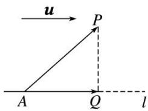
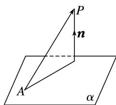

<!-- source-part:1 pages:1-13 -->

## 专题13 利用空间向量计算距离的问题

## 【方法总结】

## 1. 点 $P$ 到直线 $l$ 的距离

设 $\overrightarrow{AP} = a, m$ 是直线 $l$ 的单位方向向量，则向量 $\overrightarrow{AP}$ 在直线 $l$ 上的投影向量 $\overrightarrow{AQ} = (a \cdot m)m$ . 在 Rt△APQ 中，由勾股定理，得 $PQ = \sqrt{|A\overrightarrow{P}|^2 - |A\overrightarrow{Q}|^2} = \sqrt{a^2 - (a \cdot m)^2}$ .

## 2. 用向量法求点到直线距离的一般步骤

(1)建系：建立恰当的空间直角坐标系.

(2)求点坐标: 写出(求出)相关点的坐标.

(3)求向量: 求出相关向量的坐标 $(\overrightarrow{AP}$ , 直线 $AP$ 的单位方向向量 $\boldsymbol{m}$ .

(4)求距离 $d = \sqrt{\overrightarrow{AP}^2 - (\overrightarrow{AP}\cdot\boldsymbol{m})^2}$ .

## 3. 点 $P$ 到平面 $\alpha$ 的距离

若平面 $\alpha$ 的法向量为 $n$ ，平面 $\alpha$ 内一点为 $A$ ，则平面 $\alpha$ 外一点 $P$ 到平面 $\alpha$ 的距离 $d = \left|\frac{\vec{AP} \cdot \boldsymbol{n}}{|\boldsymbol{n}|}\right| = \frac{|\vec{AP} \cdot \boldsymbol{n}|}{|\boldsymbol{n}|}$ ，如图所示.

## 4. 用向量法求点到平面距离的一般步骤

(1)建系：建立恰当的空间直角坐标系.

(2)求点坐标: 写出(求出)相关点的坐标.

(3)求向量：求出相关向量的坐标 $(\overrightarrow{AP}, \alpha$ 内两不共线向量，平面 $\alpha$ 的法向量n).

(4)求距离 $d=\frac{|\overrightarrow{AP}\cdot n|}{|n|}$ .

## 5. 用向量法求线面距离、面面距离

(1)如果一条直线 $l$ 与一个平面 $\alpha$ 平行，可在直线 $l$ 上任取一点 $P$ ，将线面距离转化为点 $P$ 到平面 $\alpha$ 的距离求解.

(2)如果两个平面 $\alpha$ ， $\beta$ 互相平行，在其中一个平面 $\alpha$ 内任取一点 $P$ ，可将两个平行平面的距离转化为点 $P$ 到平面 $\beta$ 的距离求解.

## 6. 求点到平面的距离的常用方法

(1)直接法：过 $P$ 点作平面 $\alpha$ 的垂线，垂足为 $Q$ ，把 $PQ$ 放在某个三角形中，解三角形求出 $PQ$ 的长度就是点 $P$ 到平面 $\alpha$ 的距离.

(2)间接法：利用等体积法、特殊值法等转化求解.

(3)转化法：若点 P 所在的直线 l 平行于平面 $\alpha$ ，则转化为直线 l 上某一个点到平面 $\alpha$ 的距离来求.

(4)向量法：设平面 $\alpha$ 的一个法向量为 $n$ ， $A$ 是 $\alpha$ 内任意点，则点 $P$ 到 $\alpha$ 的距离为 $d = \frac{|\vec{PA} \cdot n|}{|n|}$ .

【例题选讲】

![[高中/总复习/专题/立体几何/专题13 利用空间向量计算距离的问题-立体几何（理科）/专题13_利用空间向量计算距离的问题_立体几何_理科_/例题/Q00039892.md]]
![[高中/总复习/专题/立体几何/专题13 利用空间向量计算距离的问题-立体几何（理科）/专题13_利用空间向量计算距离的问题_立体几何_理科_/例题/Q00039893.md]]
![[高中/总复习/专题/立体几何/专题13 利用空间向量计算距离的问题-立体几何（理科）/专题13_利用空间向量计算距离的问题_立体几何_理科_/例题/Q00039894.md]]
![[高中/总复习/专题/立体几何/专题13 利用空间向量计算距离的问题-立体几何（理科）/专题13_利用空间向量计算距离的问题_立体几何_理科_/例题/Q00039895.md]]
![[高中/总复习/专题/立体几何/专题13 利用空间向量计算距离的问题-立体几何（理科）/专题13_利用空间向量计算距离的问题_立体几何_理科_/例题/Q00039896.md]]
![[高中/总复习/专题/立体几何/专题13 利用空间向量计算距离的问题-立体几何（理科）/专题13_利用空间向量计算距离的问题_立体几何_理科_/对点训练/Q00039897.md]]
![[高中/总复习/专题/立体几何/专题13 利用空间向量计算距离的问题-立体几何（理科）/专题13_利用空间向量计算距离的问题_立体几何_理科_/对点训练/Q00039898.md]]
![[高中/总复习/专题/立体几何/专题13 利用空间向量计算距离的问题-立体几何（理科）/专题13_利用空间向量计算距离的问题_立体几何_理科_/对点训练/Q00039899.md]]
![[高中/总复习/专题/立体几何/专题13 利用空间向量计算距离的问题-立体几何（理科）/专题13_利用空间向量计算距离的问题_立体几何_理科_/对点训练/Q00039900.md]]
![[高中/总复习/专题/立体几何/专题13 利用空间向量计算距离的问题-立体几何（理科）/专题13_利用空间向量计算距离的问题_立体几何_理科_/对点训练/Q00039901.md]]
![[高中/总复习/专题/立体几何/专题13 利用空间向量计算距离的问题-立体几何（理科）/专题13_利用空间向量计算距离的问题_立体几何_理科_/对点训练/Q00039902.md]]
![[高中/总复习/专题/立体几何/专题13 利用空间向量计算距离的问题-立体几何（理科）/专题13_利用空间向量计算距离的问题_立体几何_理科_/对点训练/Q00039903.md]]
