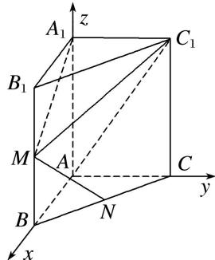

> [!faq]- 《专题13 利用空间向量计算距离的问题-立体几何（理科）》例题解析
>
> > [!success]- **【答案】** 详见解析
>
> > [!note]- **【分析】**
> > 本题未单列分析。
>
> > [!note]- **【解析】**
> > (1)求点 M 到直线 $AC_{1}$ 的距离;
> > (2)求点 N 到平面 $MA_{1}C_{1}$ 的距离.
> > 解析 (1)建立如图所示的空间直角坐标系，
> > 
> > 则 $A(0, 0, 0)$ ， $A_{1}(0, 0, 2)$ ， $M(2, 0, 1)$ ， $C_{1}(0, 2, 2)$ ，
> > 直线 $AC_{1}$ 的一个单位方向向量为 $s_{0}=\left(0,\frac{\sqrt{2}}{2},\frac{\sqrt{2}}{2}\right)$ ， $\overrightarrow{AM}=(2,0,1)$ ,
> > 故点 M 到直线 $AC_{1}$ 的距离 $d=\sqrt{|\overrightarrow{AM}|^{2}-|\overrightarrow{AM}\cdot s_{0}|^{2}}=\sqrt{5-\frac{1}{2}}=\frac{3\sqrt{2}}{2}$ .
> > (2)设平面 $MA_{1}C_{1}$ 的一个法向量为 $\pmb {n} = (x,y,z)$ ，则 $\left\{ \begin{array}{l}\pmb {n}\cdot \overrightarrow{A_1C_1} = 0,\\ \pmb {n}\cdot \overrightarrow{A_1M} = 0, \end{array} \right.$ 即 $\left\{ \begin{array}{l}2y = 0,\\ 2x - z = 0, \end{array} \right.$ 取 $x = 1$ ，得 $z = 2$
> > 故 $n = (1, 0, 2)$ 为平面 $MA_{1}C_{1}$ 的一个法向量，因为 $N(1, 1, 0)$ ，所以 $\overrightarrow{MN} = (-1, 1, -1)$ ，
> > 故 N 到平面 $MA_{1}C_{1}$ 的距离 $d=\frac{|\overrightarrow{MN}\cdot\boldsymbol{n}|}{|\boldsymbol{n}|}=\frac{3}{\sqrt{5}}=\frac{3\sqrt{5}}{5}$ .
