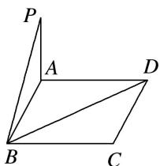

<!-- question-source:start -->
1. 如图, $P$ 为矩形 $ABCD$ 所在平面外一点, $PA \perp$ 平面 $ABCD$ , 若已知 $AB = 3$ , $AD = 4$ , $PA = 1$ , 求点 $P$ 到 $BD$ 的距离.

<!-- question-source:end -->

![[高中/总复习/专题/立体几何/专题13 利用空间向量计算距离的问题-立体几何（理科）/专题13_利用空间向量计算距离的问题_立体几何_理科_/对点训练/answers/Q00039897A1.md]]
