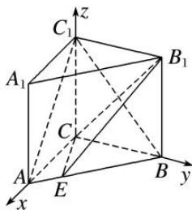

<!-- question-source:start -->
[例 1] 在直三棱柱 $ABC-A_{1}B_{1}C_{1}$ 中，AC=3，BC=4，AB=5， $AA_{1}=4$ .

(1)求证： $AC \perp BC_{1}$ ;

(2)请说明在 AB 上是否存在点 E，使得 $AC_{1} \parallel$ 平面 $CEB_{1}$ .

(1)在直三棱柱 $ABC - A_{1}B_{1}C_{1}$ 中，因为 $AC = 3$ ， $BC = 4$ ， $AB = 5$ ，所以 $AC$ ， $BC$ ， $CC_{1}$ 两两垂直，以 $C$ 为坐标原点，直线 $CA$ ， $CB$ ， $CC_{1}$ 分别为 $x$ 轴， $y$ 轴， $z$ 轴建立如图所示的空间直角坐标系.

则 $C(0, 0, 0)$ ， $A(3, 0, 0)$ ， $C_{1}(0, 0, 4)$ ， $B(0, 4, 0)$ ， $B_{1}(0, 4, 4)$ .

因为 $\overrightarrow{AC} = (-3, 0, 0)$ , $\overrightarrow{BC_1} = (0, -4, 4)$ , 所以 $\overrightarrow{AC} \cdot \overrightarrow{BC_1} = 0$ , 所以 $\overrightarrow{AC} \perp \overrightarrow{BC_1}$ , 即 $AC \perp BC_1$ .

(2)假设在 AB 上存在点 E，使得 $AC_{1} \parallel$ 平面 $CEB_{1}$ ，设 $\overrightarrow{AE}=t\overrightarrow{AB}=(-3t,4t,0)$ ，其中 $0 \leqslant t \leqslant 1$ .

则 $E(3 - 3t, 4t, 0), \overrightarrow{B_1E} = (3 - 3t, 4t - 4, -4), \overrightarrow{B_1C} = (0, -4, -4)$ .

又因为 $\overrightarrow{AC_{1}}=m\overrightarrow{B_{1}E}+n\overrightarrow{B_{1}C}$ 成立，所以 $m(3-3t)=-3,\quad m(4t-4)-4n=0,\quad-4m-4n=4$ ，解得 $t=\frac{1}{2}$ .

所以在 AB 上存在点 E，使得 $AC_{1} \parallel$ 平面 $CEB_{1}$ ，这时点 E 为 AB 的中点.
<!-- question-source:end -->

![[高中/总复习/专题/立体几何/专题14 利用空间向量解决立体几何中的探索性问题-立体几何（理科）/考点01_探究线面的位置关系/例题/answers/Q00043809A1.md]]
