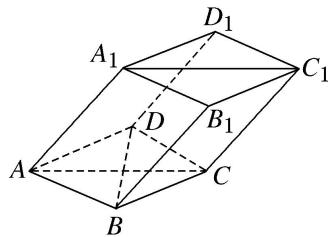
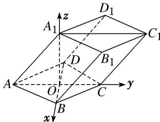

<!-- question-source:start -->
[例2] 如图，棱柱 $ABCD - A_{1}B_{1}C_{1}D_{1}$ 的所有棱长都等于2， $\angle ABC$ 和 $\angle A_{1}AC$ 均为 $60^{\circ}$ ，平面 $AA_{1}C_{1}C$ $\perp$ 平面 $ABCD$ .

(1)求证： $BD \perp AA_{1}$ ;

(2)在直线 $CC_1$ 上是否存在点 $P$ ，使 $BP \parallel$ 平面 $DA_1C_1$ ，若存在，求出点 $P$ 的位置；若不存在，请说明理由.

(1)设 BD 与 AC 交于点 O，则 $BD \perp AC$ ，连接 $A_{1}O$ ，

在 $\triangle AA_{1}O$ 中， $AA_{1}=2,\quad AO=1,\quad\angle A_{1}AO=60^{\circ},\quad\therefore A_{1}O^{2}=AA_{1}^{2}+AO^{2}-2AA_{1}\cdot AO\cos60^{\circ}=3,$ $\therefore AO^{2} + A_{1}O^{2} = AA_{1}^{2}, \therefore A_{1}O \perp AO.$

由于平面 $AA_{1}C_{1}C \perp$ 平面 ABCD，且平面 $AA_{1}C_{1}C \cap$ 平面 ABCD = AC， $A_{1}O \subset$ 平面 $AA_{1}C_{1}C$ ，

$\therefore A_{1}O \perp$ 平面 $ABCD$ 。以 $OB, OC, OA_{1}$ 所在直线分别为 $x$ 轴， $y$ 轴， $z$ 轴，建立如图所示的空间直角坐标系，则 $A(0, -1, 0), B(\sqrt{3}, 0, 0), C(0, 1, 0), D(-\sqrt{3}, 0, 0), A_{1}(0, 0, \sqrt{3}), C_{1}(0, 2, \sqrt{3})$ 。

由于 $\overrightarrow{BD}=(-2\sqrt{3},0,0)$ ， $\overrightarrow{AA_{1}}=(0,1,\sqrt{3})$ ， $\overrightarrow{AA_{1}}\cdot\overrightarrow{BD}=0\times(-2\sqrt{3})+1\times0+\sqrt{3}\times0=0$ ，

$\therefore\overrightarrow{BD}\perp\overrightarrow{AA_{1}}$ ，即 $BD\perp AA_{1}$ .

(2)假设在直线 $CC_{1}$ 上存在点 P，使 $BP \parallel$ 平面 $DA_{1}C_{1}$ ,

设 $\overrightarrow{CP} = \lambda \overrightarrow{C C_1}$ ， $P(x,y,z)$ ，则 $(x,y - 1,z) = \lambda (0,1,\sqrt{3})$

从而有 $P(0, 1 + \lambda, \sqrt{3}\lambda)$ ， $\overrightarrow{BP}=(-\sqrt{3}, 1 + \lambda, \sqrt{3}\lambda)$ .

设平面 $DA_{1}C_{1}$ 的法向量为 $n_{3}=(x_{3}, y_{3}, z_{3})$ ，则 $\left\{\begin{aligned}n_{3}\perp\overrightarrow{A_{1}C_{1}},\\ n_{3}\perp\overrightarrow{DA_{1}},\end{aligned}\right.$

又 $\overrightarrow{A_{1}C_{1}}=(0,2,0)$ ， $\overrightarrow{DA_{1}}=(\sqrt{3},0,\sqrt{3})$ ，则 $\left\{\begin{aligned}&2y_{3}=0,\\&\sqrt{3}x_{3}+\sqrt{3}z_{3}=0,\end{aligned}\right.$

取 $n_{3}=(1,0,-1)$ ，因为 $BP \parallel$ 平面 $DA_{1}C_{1}$ ，则 $n_{3} \perp \overrightarrow{BP}$ ，即 $n_{3} \cdot \overrightarrow{BP} = -\sqrt{3} - \sqrt{3}\lambda = 0$ ，得 $\lambda = -1$ ，即点 P 在 $C_{1}C$ 的延长线上，且 $C_{1}C = CP$ 。
<!-- question-source:end -->

![[高中/总复习/专题/立体几何/专题14 利用空间向量解决立体几何中的探索性问题-立体几何（理科）/考点01_探究线面的位置关系/例题/answers/Q00043810A1.md]]
