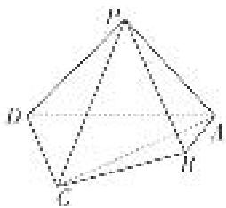

<!-- question-source:start -->
[例3] 如图所示，在四棱锥 $P - ABCD$ 中，平面 $PAD \perp$ 平面 $ABCD$ ， $PA \perp PD$ ， $PA = PD$ ， $AB \perp AD$ ， $AB = 1$ ， $AD = 2$ ， $AC = CD = \sqrt{5}$

(1)求证： $PD \perp$ 平面 PAB;

(2)求直线 PB 与平面 PCD 所成角的正弦值;

(3)在棱 $PA$ 上是否存在点 $M$ , 使得 $BM \parallel$ 平面 $PCD$ ? 若存在, 求 $\frac{AM}{AP}$ 的值; 若不存在, 说明理由.

<!-- question-source:end -->

![[高中/总复习/专题/立体几何/专题14 利用空间向量解决立体几何中的探索性问题-立体几何（理科）/考点01_探究线面的位置关系/例题/answers/Q00043811A1.md]]
