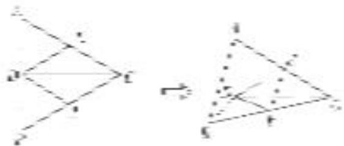
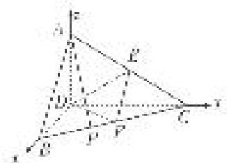

<!-- question-source:start -->
[例 5] 如图，正三角形 ABC 的边长为 4，CD 为 AB 边上的高，E，F 分别是 AC 和 BC 边的中点，现将 $\triangle ABC$ 沿 CD 翻折成直二面角 A-DC-B.

(1)试判断直线 AB 与平面 DEF 的位置关系，并说明理由；

(2)在线段 $BC$ 上是否存在一点 $P$ , 使 $AP \perp DE$ ? 如果存在, 求出 $\frac{BP}{BC}$ 的值; 如果不存在, 请说明理由.

(1) $AB \parallel$ 平面 $DEF$ . 理由如下:

在 $\triangle ABC$ 中，由 $E$ ， $F$ 分别是 $AC$ ， $BC$ 的中点，得 $EF//AB$ .

又因为 $AB \nmid$ 平面 $DEF$ , $EF \subset$ 平面 $DEF$ , 所以 $AB \parallel$ 平面 $DEF$ .

(2)以点 D 为坐标原点，直线 DB, DC, DA 分别为 x 轴、y 轴、z 轴，建立空间直角坐标系(如图所示)，则 $D(0, 0, 0)$ ， $A(0, 0, 2)$ ， $B(2, 0, 0)$ ， $C(0, 2\sqrt{3}, 0)$ ， $E(0, \sqrt{3}, 1)$ ，故 $\overrightarrow{DE} = (0, \sqrt{3}, 1)$ .

假设存在点 $P(x, y, 0)$ 满足条件，则 $\overrightarrow{AP} = (x, y, -2)$ ， $\overrightarrow{AP} \cdot \overrightarrow{DE} = \sqrt{3}y - 2 = 0$ ，所以 $y = \frac{2\sqrt{3}}{3}$ .

又 $\overrightarrow{BP}=(x-2,\ y,\ 0),\ \overrightarrow{PC}=(-x,\ 2\sqrt{3}-y,\ 0),\ \overrightarrow{BP}//\ \overrightarrow{PC},$

所以 $(x-2)(2\sqrt{3}-y)=-xy$ ，所以 $\sqrt{3}x+y=2\sqrt{3}$ 。把 $y=\frac{2\sqrt{3}}{3}$ 代入上式得 $x=\frac{4}{3}$ ，所以 $\overrightarrow{BP}=\frac{1}{3}\overrightarrow{BC}$ ，

所以在线段 BC 上存在点 P 使 $AP \perp DE$ ，此时 $\frac{BP}{BC} = \frac{1}{3}$ .
<!-- question-source:end -->

![[高中/总复习/专题/立体几何/专题14 利用空间向量解决立体几何中的探索性问题-立体几何（理科）/考点01_探究线面的位置关系/例题/answers/Q00043813A1.md]]
