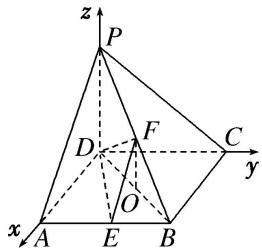

> [!faq]- 《专题14 利用空间向量解决立体几何中的探索性问题-立体几何（理科）》例题解析
>
> > [!success]- **【答案】** 详见解析
>
> > [!note]- **【分析】**
> > 本题未单列分析。
>
> > [!note]- **【解析】**
> > (1)求证： $EF \perp CD;$
> > (2)在平面 PAD 内是否存在一点 G，使 $GF \perp$ 平面 PCB？若存在，求出点 G 坐标；若不存在，试说明理由.
> > 解析 (1)由题意知，DA, DC, DP 两两垂直．如图，以 DA, DC, DP 所在直线分别为 x 轴，y 轴，z 轴建立空间直角坐标系，设 AD=a，则 D(0, 0, 0)，A(a, 0, 0)，B(a, a, 0)，C(0, a, 0)， $E\left[\begin{matrix}a, & \frac{a}{2}, & 0\end{matrix}\right]$ ， $P(0, 0, a)$ ， $F\left(\frac{a}{2}, \frac{a}{2}, \frac{a}{2}\right)$ 。 $\overrightarrow{EF}=\left(-\frac{a}{2}, 0, \frac{a}{2}\right)$ ， $\overrightarrow{DC}=(0, a, 0)$ 。 $\because \overrightarrow{EF} \cdot \overrightarrow{DC}=0$ ， $\therefore \overrightarrow{EF} \perp \overrightarrow{DC}$ ，从而得 $EF \perp CD$ 。
> > 
> > (2)假设存在满足条件的点 G，设 $G(x, 0, z)$ ，则 $\overrightarrow{FG}=\left(x-\frac{a}{2}, -\frac{a}{2}, z-\frac{a}{2}\right)$ ,
> > 若使 $GF \perp$ 平面 $PCB$ ，则由 $\overrightarrow{FG} \cdot \overrightarrow{CB} = \left( x - \frac{a}{2}, -\frac{a}{2}, z - \frac{a}{2} \right) \cdot (a, 0, 0) = a \left( x - \frac{a}{2} \right) = 0$ ，得 $x = \frac{a}{2}$ ;
> > 由 $\overrightarrow{FG} \cdot \overrightarrow{CP} = \left( x - \frac{a}{2}, -\frac{a}{2}, z - \frac{a}{2} \right) \cdot (0, -a, a) = \frac{a^2}{2} + a \left( z - \frac{a}{2} \right) = 0$ ，得 $z = 0$ .
> > ∴ G 点坐标为 $\left[\frac{a}{2}, 0, 0\right]$ ，故存在满足条件的点 G，且点 G 为 AD 的中点.
