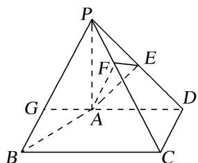
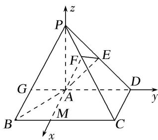

> [!faq]- 《专题14 利用空间向量解决立体几何中的探索性问题-立体几何（理科）》例题解析
>
> > [!success]- **【答案】** 详见解析
>
> > [!note]- **【分析】**
> > 本题未单列分析。
>
> > [!note]- **【解析】**
> > (1)求证： $CD \perp$ 平面 PAD;
> > (2)求二面角 F-AE-P 的余弦值;
> > (3)设点 G 在 PB 上，且 $\frac{PG}{PB} = \frac{2}{3}$ . 判断直线 AG 是否在平面 AEF 内，说明理由.
> > 
> > 解析 (1)因为 $PA \perp$ 平面 $ABCD$ , $CD \subset$ 平面 $ABCD$ , 所以 $PA \perp CD$ .
> > 又因为 $AD \perp CD$ ， $PA \cap AD = A$ ，PA， $AD \subset$ 平面 PAD，所以 $CD \perp$ 平面 PAD.
> > (2)过点 A 作 AD 的垂线交 BC 于点 M. 因为 PA⊥平面 ABCD, AM, AD⊂平面 ABCD,
> > 所以 $PA \perp AM$ ， $PA \perp AD$ 。建立如图所示的空间直角坐标系 A-xyz，
> > 则 $A(0, 0, 0)$ ， $B(2, -1, 0)$ ， $C(2, 2, 0)$ ， $D(0, 2, 0)$ ， $P(0, 0, 2)$ .
> > 
> > 因为 E 为 PD 的中点，所以 $E(0, 1, 1)$ 。所以 $\overrightarrow{AE} = (0, 1, 1)$ ， $\overrightarrow{PC} = (2, 2, -2)$ ， $\overrightarrow{AP} = (0, 0, 2)$ 。
> > 所以 $\overrightarrow{PF} = \frac{1}{3}\overrightarrow{PC} = \left[\frac{2}{3},\frac{2}{3}, - \frac{2}{3}\right]$ 所以 $\overrightarrow{AF} = \overrightarrow{AP} +\overrightarrow{PF} = \left[\frac{2}{3},\frac{2}{3},\frac{4}{3}\right].$
> > 设平面 AEF 的法向量为 $\boldsymbol{n}=(x,y,z)$ ，则 $\left\{\begin{aligned}\boldsymbol{n}\cdot\overrightarrow{AE}=0,\\ \boldsymbol{n}\cdot\overrightarrow{AF}=0,\end{aligned}\right.$ 即 $\left\{\begin{aligned}y+z=0,\\ \frac{2}{3}x+\frac{2}{3}y+\frac{4}{3}z=0.\end{aligned}\right.$ 令 z=1，则 y=-1，x=-1。
> > 于是 $n=(-1,-1,1)$ . 又因为平面 PAD 的一个法向量为 $p=(1,0,0)$ ,
> > 所以 $\cos<n,\ p>=\frac{n\cdot p}{|n||p|}=-\frac{\sqrt{3}}{3}$ . 由题知，二面角 F-AE-P 为锐角，所以其余弦值为 $\frac{\sqrt{3}}{3}$ .
> > (3)直线 $AG$ 在平面 $AEF$ 内，理由如下：
> > 因为点 G 在 PB 上，且 $\frac{PG}{PB} = \frac{2}{3}$ ， $\overrightarrow{PB} = (2, -1, -2)$ ，所以 $\overrightarrow{PG} = \frac{2}{3}\overrightarrow{PB} = \left(\frac{4}{3}, -\frac{2}{3}, -\frac{4}{3}\right)$ ,
> > 所以 $\overrightarrow{AG} = \overrightarrow{AP} +\overrightarrow{PG} = \left(\frac{4}{3}, - \frac{2}{3},\frac{2}{3}\right)$ 由(2)知，平面 $AEF$ 的一个法向量 $\pmb {n} = (-1, - 1,1),$
> > 所以 $\overrightarrow{AG} \cdot n = -\frac{4}{3} + \frac{2}{3} + \frac{2}{3} = 0$ 。又点 $A \in$ 平面 $AEF$ ，所以直线 $AG$ 在平面 $AEF$ 内。
> > ## 【对点训练】
