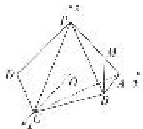

> [!faq]- 《专题14 利用空间向量解决立体几何中的探索性问题-立体几何（理科）》例题解析
>
> > [!success]- **【答案】** 详见解析
>
> > [!note]- **【分析】**
> > 本题未单列分析。
>
> > [!note]- **【解析】**
> > 解析
> > (1)因为平面 $PAD \perp$ 平面 $ABCD$ ，平面 $PAD \cap$ 平面 $ABCD = AD$ ， $AB \perp AD$ ，所以 $AB \perp$ 平面 $PAD$ ，所以 $AB \perp PD$ 。又因为 $PA \perp PD$ ， $PA \cap AB = A$ ，所以 $PD \perp$ 平面 $PAB$ 。
> >
> > (2)取 $AD$ 的中点 $O$ ，连接 $PO$ ， $CO$ 。因为 $PA = PD$ ，所以 $PO \perp AD$ 。又因为 $PO \subset$ 平面 $PAD$ ，平面 $PAD \perp$ 平面 $ABCD$ ，平面 $PAD \cap$ 平面 $ABCD = AD$ ，所以 $PO \perp$ 平面 $ABCD$ 。
> >
> > 因为 $CO \subset$ 平面 $ABCD$ ，所以 $PO \perp CO$ 。因为 $AC = CD$ ，所以 $CO \perp AD$ 。
> >
> > 如图，建立空间直角坐标系 $Oxyz$ 。
> >
> > 
> >
> > 由题意得， $A(0,1,0),B(1,1,0),C(2,0,0),D(0, - 1,0),P(0,0,1).$ 则 $P\overrightarrow{D} = (0, - 1, - 1),P\overrightarrow{C} = (2,0, - 1).$
> >
> > 设平面 PCD 的法向量为 $\boldsymbol{n}=(x,y,z)$ ，则 $\left\{\begin{aligned}\boldsymbol{n}\cdot\overrightarrow{PD}&=0,\\ \boldsymbol{n}\cdot\overrightarrow{PC}&=0,\end{aligned}\right.$ 即 $\left\{\begin{aligned}-y-z&=0,\\ 2x-z&=0.\end{aligned}\right.$
> >
> > 令 z=2，则 x=1，y=-2，所以 $n=(1,-2,2)$ .
> >
> > 又 $\overrightarrow{PB} = (1, 1, -1)$ ，所以 $\cos < n$ ， $\overrightarrow{PB} > = \frac{n \cdot \overrightarrow{PB}}{|n||\overrightarrow{PB}|} = -\frac{\sqrt{3}}{3}$ ，
> >
> > 所以直线 PB 与平面 PCD 所成角的正弦值为 $\frac{\sqrt{3}}{3}$ .
> >
> > (3)设棱 PA 上存在点 M，使得 $BM \parallel$ 平面 PCD，则存在 $\lambda \in [0, 1]$ 使得 $\overrightarrow{AM} = \lambda \overrightarrow{AP}$ .
> >
> > 因此点 $M(0, 1 - \lambda, \lambda)$ ， $\overrightarrow{BM} = (-1, -\lambda, \lambda)$ 。因为 BM // 平面 PCD，
> >
> > 所以 $\overrightarrow{BM}\cdot n=0$ ，即 $(-1,-\lambda,\lambda)\cdot(1,-2,2)=0$ ，解得 $\lambda=\frac{1}{4}$ .
> >
> > 所以在棱 PA 上存在点 M 使得 BM// 平面 PCD，此时 $\frac{AM}{AP} = \frac{1}{4}$ .
