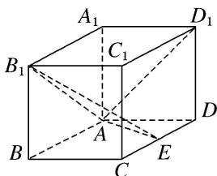

<!-- question-source:start -->
1. 如图，在长方体 $ABCD - A_{1}B_{1}C_{1}D_{1}$ 中， $AA_{1} = AD = 1$ ， $E$ 为 $CD$ 的中点.

(1)求证： $B_{1}E\bot AD_{1}$

(2)在棱 $AA_{1}$ 上是否存在一点 $P$ ，使得 $DP \parallel$ 平面 $B_{1}AE$ ？若存在，求 $AP$ 的长；若不存在，说明理由.

<!-- question-source:end -->

![[高中/总复习/专题/立体几何/专题14 利用空间向量解决立体几何中的探索性问题-立体几何（理科）/考点01_探究线面的位置关系/对点训练/answers/Q00039910A1.md]]
