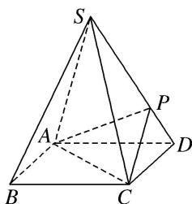
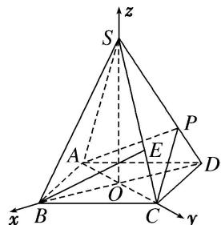

> [!faq]- 《专题14 利用空间向量解决立体几何中的探索性问题-立体几何（理科）》例题解析
>
> > [!success]- **【答案】** 详见解析
>
> > [!note]- **【分析】**
> > 本题未单列分析。
>
> > [!note]- **【解析】**
> > (1)求证： $AC\bot SD$
> > (2)若 $SD \perp$ 平面 $PAC$ ，则侧棱 $SC$ 上是否存在一点 $E$ ，使得 $BE //$ 平面 $PAC$ 。若存在，求 $SE:EC$ 的值；若不存在，试说明理由。
> > 
> > 3. 解析 (1)连接 $BD$ , 设 $AC$ 交 $BD$ 于点 $O$ , 则 $AC \perp BD$ . 连接 $SO$ , 由题意知 $SO \perp$ 平面 $ABCD$ .
> > 
> > 以 O 为坐标原点， $\overrightarrow{OB}, \overrightarrow{OC}, \overrightarrow{OS}$ 所在直线分别为 x 轴，y 轴，z 轴，建立空间直角坐标系，如图.
> > 底面边长为 $a$ ，则高 $SO = \frac{\sqrt{6}}{2} a$ ，于是 $S\left(0, 0, \frac{\sqrt{6}}{2} a\right)$ ， $D\left[-\frac{\sqrt{2}}{2} a, 0, 0\right)$ ， $B\left(\frac{\sqrt{2}}{2} a, 0, 0\right)$ ， $C\left(0, \frac{\sqrt{2}}{2} a, 0\right)$ ，
> > $\overrightarrow{OC} = \left(0, \frac{\sqrt{2}}{2} a, 0\right)$ , $\overrightarrow{SD} = \left(-\frac{\sqrt{2}}{2} a, 0, -\frac{\sqrt{6}}{2} a\right)$ , 则 $\overrightarrow{OC} \cdot \overrightarrow{SD} = 0$ . 故 $OC \perp SD$ . 从而 $AC \perp SD$ .
> > (2)棱 $SC$ 上存在一点 $E$ , 使 $BE \parallel$ 平面 $PAC$ . 理由如下:
> > 由已知条件知 $\overrightarrow{DS}$ 是平面 $PAC$ 的一个法向量，且 $\overrightarrow{DS} = \left[\frac{\sqrt{2}}{2} a, 0, \frac{\sqrt{6}}{2} a\right]$ ， $\overrightarrow{CS} = \left[0, -\frac{\sqrt{2}}{2} a, \frac{\sqrt{6}}{2} a\right]$ ,
> > $\overrightarrow{BC} = \left[-\frac{\sqrt{2}}{2} a, \frac{\sqrt{2}}{2} a, 0\right].$ 设 $\overrightarrow{CE} = t\overrightarrow{CS}$ ，则 $\overrightarrow{BE} = \overrightarrow{BC} + \overrightarrow{CE} = \overrightarrow{BC} + t\overrightarrow{CS}$
> > $= \left(-\frac{\sqrt{2}}{2} a, \frac{\sqrt{2}}{2} a, 1 - t, \frac{\sqrt{6}}{2} at\right)$ ，而 $\overrightarrow{BE} \cdot \overrightarrow{DS} = 0 \Rightarrow t = \frac{1}{3}$ .
> > 即当 $SE:EC = 2:1$ 时， $\overrightarrow{BE}\bot \overrightarrow{DS}$ .而 $BE\not\subset$ 平面PAC，故 $BE / /$ 平面PAC.
