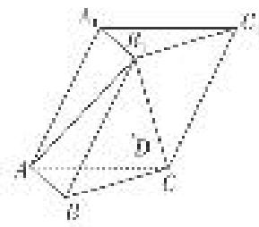
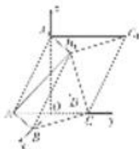

> [!faq]- 《专题14 利用空间向量解决立体几何中的探索性问题-立体几何（理科）》例题解析
>
> > [!success]- **【答案】** 详见解析
>
> > [!note]- **【分析】**
> > 本题未单列分析。
>
> > [!note]- **【解析】**
> > (1)求侧棱 $AA_{1}$ 与平面 $AB_{1}C$ 所成角的正弦值的大小；
> > (2)已知点 $D$ 满足 $\overrightarrow{BD} = \overrightarrow{BA} +\overrightarrow{BC}$ ，在直线 $AA_{1}$ 上是否存在点 $P$ ，使 $DP / /$ 平面 $AB_{1}C?$ 若存在，请确定点 $P$ 的位置；若不存在，请说明理由.
> > 
> > 2. 解析
> > (1)因为侧面 $A_{1}ACC_{1} \perp$ 底面 $ABC$ , 作 $A_{1}O \perp AC$ 于点 $O$ , 所以 $A_{1}O \perp$ 平面 $ABC$ , 所以 $A_{1}O \perp BO$ . 又 $\angle A_{1}AC = 60^{\circ}$ , 且各棱长均为 2, 所以 $AO = 1$ , $OA_{1} = OB = \sqrt{3}$ , $BO \perp AC$ .
> > 故以 O 为坐标原点，建立如图所示的空间直角坐标系 Oxyz,
> > 
> > 则 $A(0, -1, 0), B(\sqrt{3}, 0, 0), A_{1}(0, 0, \sqrt{3}), C(0, 1, 0), B_{1}(\sqrt{3}, 1, \sqrt{3})$
> > 所以 $\overrightarrow{AA_{1}}=(0,1,\sqrt{3})$ ， $\overrightarrow{AB_{1}}=(\sqrt{3},2,\sqrt{3})$ ， $\overrightarrow{AC}=(0,2,0)$ .
> > 设平面 $AB_{1}C$ 的一个法向量为 $\boldsymbol{n}=(x,y,1)$ ，则 $\left\{\begin{aligned}\boldsymbol{n}\cdot\overrightarrow{AB_{1}}&=\sqrt{3}x+2y+\sqrt{3}=0,\\ \boldsymbol{n}\cdot A\overrightarrow{C}&=2y=0,\end{aligned}\right.$ 解得 $\boldsymbol{n}=(-1,0,1)$ .
> > 所以 $\cos<\overrightarrow{AA_{1}},\quad n>=\frac{\overrightarrow{AA_{1}}\cdot\boldsymbol{n}}{|\overrightarrow{AA_{1}}||\boldsymbol{n}|}=\frac{\sqrt{3}}{2\sqrt{2}}=\frac{\sqrt{6}}{4}.$
> > 所以侧棱 $AA_{1}$ 与平面 $AB_{1}C$ 所成角的正弦值的大小为 $\frac{\sqrt{6}}{4}$ .
> > (2)因为 $B\overrightarrow{D} = B\overrightarrow{A} + B\overrightarrow{C}$ ，而 $B\overrightarrow{A} = (-\sqrt{3}, -1, 0)$ ， $B\overrightarrow{C} = (-\sqrt{3}, 1, 0)$ ，所以 $B\overrightarrow{D} = (-2\sqrt{3}, 0, 0)$ .
> > 又因为 $B(\sqrt{3}, 0, 0)$ ，所以点 D 的坐标为 $(- \sqrt{3}, 0, 0)$ .
> > 假设存在点 P 符合题意，则其坐标可设为 $P(0, y, z)$ ，所以 $D \vec{P} = (\sqrt{3}, y, z)$ .
> > 因为 DP // 平面 $AB_{1}C$ ， $n=(-1,0,1)$ 为平面 $AB_{1}C$ 的一个法向量，所以 $D\vec{P}\cdot n=0$ ，即 $z=\sqrt{3}$ .
> > 因为 $A \vec{P} = (0, y + 1, z)$ ，则由 $A \vec{P} = \lambda A A_{1}$ 得 $\left\{\begin{aligned} y + 1 &= \lambda, \\ \sqrt{3} &= \lambda \sqrt{3}, \end{aligned}\right.$ 所以 y = 0.
> > 又 $DP \nmid$ 平面 $AB_{1}C$ ，故存在点 $P$ ，使 $DP \parallel$ 平面 $AB_{1}C$ ，其坐标为 $(0, 0, \sqrt{3})$ ，即恰好为点 $A_{1}$ .
