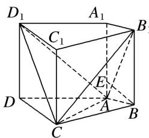
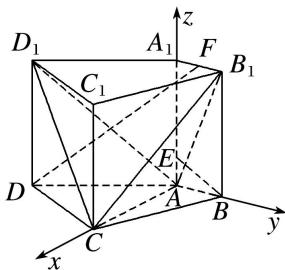

> [!faq]- 《专题14 利用空间向量解决立体几何中的探索性问题-立体几何（理科）》例题解析
>
> > [!success]- **【答案】** 详见解析
>
> > [!note]- **【分析】**
> > 本题未单列分析。
>
> > [!note]- **【解析】**
> > (1)求证： $BE \perp$ 平面 $ACB_{1}$ ;
> >
> > (2)求二面角 $D_{1} - AC - B_{1}$ 的余弦值；
> >
> > (3)在棱 $A_{1}B_{1}$ 上是否存在点 $F$ ，使得直线 $DF \parallel$ 平面 $ACB_{1}$ ? 若存在，求 $A_{1}F$ 的长；若不存在，请说明理由.
> >
> > 
> >
> > 4. 解析
> > (1) 因为 $A_{1}A \perp$ 底面 ABCD，所以 $A_{1}A \perp AC$ .
> >
> > 解析
> > (1) 因为 $A|A \perp$ 底面 $ABCD$ ，所以 $A|A \perp AC$ .
> >
> > 又因为 $AB \perp AC$ ， $AA_1 \cap AB = A$ ，且 $AA_1$ ， $AB \subset$ 平面 $ABB_1A_1$ ，所以 $AC \perp$ 平面 $ABB_1A_1$ ，
> >
> > 又因为 $BE \subset$ 平面 $ABB_1A_1$ ，所以 $AC \perp BE$ .
> >
> > 因为 $\frac{AE}{AB} = \frac{1}{2} = \frac{AB}{BB_1}$ ，所以 $\angle ABE = \angle AB_1B$ .
> >
> > 因为 $\angle BAB_1 + \angle AB_1B = 90^\circ$ ，所以 $\angle BAB_1 + \angle ABE = 90^\circ$ ，所以 $BE \perp AB_1$ .
> >
> > 又 $AB_1 \cap AC = A$ ，且 $AB_1$ ， $AC \subset$ 平面 $ACB_1$ ，所以 $BE \perp$ 平面 $ACB_1$ .
> >
> > (2)如图，以 A 为原点建立空间直角坐标系 A-xyz，依题意可得 $A(0, 0, 0)$ ， $B(0, 1, 0)$ ， $C(2, 0, 0)$ ， $D(1, -2, 0)$ ， $D_{1}(1, -2, 2)$ ， $E\left(0, 0, \frac{1}{2}\right)$ 。由
> > (1)知， $\overrightarrow{EB}=\left(0, 1, -\frac{1}{2}\right)$ 为平面 $ACB_{1}$ 的一个法向量。
> >
> > 
> >
> > 设 $\boldsymbol{n}=(x,\ y,\ z)$ 为平面 $ACD_{1}$ 的法向量．因为 $\overrightarrow{AD_{1}}=(1,\ -2,\ 2),\ \overrightarrow{AC}=(2,\ 0,\ 0)$
> >
> > 所以 $\left\{ \begin{array}{l} n \cdot \overrightarrow{AD_1} = 0, \\ n \cdot \overrightarrow{AC} = 0, \end{array} \right.$ 即 $\left\{ \begin{array}{l} x - 2y + 2z = 0, \\ 2x = 0. \end{array} \right.$ 不妨设 $z = 1$ ，可得 $n = (0, 1, 1)$ .
> >
> > 因此 $\cos<n,\quad\overrightarrow{EB}>\frac{\boldsymbol{n}\cdot\overrightarrow{EB}}{|\boldsymbol{n}|\cdot|\overrightarrow{EB}|}=\frac{\sqrt{10}}{10}.$
> >
> > 由图可知二面角 $D_{1} - AC - B_{1}$ 为锐角，所以二面角 $D_{1} - AC - B_{1}$ 的余弦值为 $\frac{\sqrt{10}}{10}$ .
> >
> > (3)假设存在满足题意的点 $F$ 。设 $A_{1}F = a (a > 0)$ ，则由
> > (2)得 $F(0, a, 2)$ ， $\vec{DF} = (-1, a + 2, 2)$ .
> >
> > 由题意可知 $\overrightarrow{DF}\cdot\overrightarrow{EB}=(-1,a+2,2)\cdot\begin{pmatrix}0,&1,&-\frac{1}{2}\end{pmatrix}=a+2-1=0$ ，解得a=-1(舍去)，
> >
> > 即直线 DF 的方向向量与平面 $ACB_{1}$ 的法向量不垂直.
> >
> > 所以，在棱 $A_{1}B_{1}$ 上不存在点 F，使得直线 $DF \parallel$ 平面 $ACB_{1}$ .
