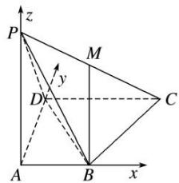

> [!faq]- 《专题14 利用空间向量解决立体几何中的探索性问题-立体几何（理科）》例题解析
>
> > [!success]- **【答案】** 详见解析
>
> > [!note]- **【分析】**
> > 本题未单列分析。
>
> > [!note]- **【解析】**
> > (1)求证： $BM / /$ 平面PAD；
> > (2)平面 PAD 内是否存在一点 N，使 $MN \perp$ 平面 PBD？若存在，确定 N 的位置；若不存在，说明理由.
> > 5. 解析
> > (1)以 A 为原点，以 AB, AD, AP 所在直线分别为 x 轴、y 轴、z 轴建立空间直角坐标系，则 $B(1, 0, 0)$ ， $D(0, 2, 0)$ ， $P(0, 0, 2)$ ， $C(2, 2, 0)$ ， $M(1, 1, 1)$ ，
> > 
> > $\because \overrightarrow{BM} = (0, 1, 1)$ ，平面 $PAD$ 的一个法向量为 $n = (1, 0, 0)$ ， $\therefore \overrightarrow{BM} \cdot n = 0$ ，即 $\overrightarrow{BM} \perp n$ ，又 $BM \not\subset$ 平面 $PAD$ ， $\therefore BM //$ 平面 $PAD$ .
> > (2)由
> > (1)知， $\overrightarrow{BD}=(-1,2,0)$ ， $\overrightarrow{PB}=(1,0,-2)$ ，假设平面PAD内存在一点N，使 $MN\perp$ 平面PBD.
> > 设 $N(0, y, z)$ ，则 $\overrightarrow{MN}=(-1, y-1, z-1)$ ，从而 $MN\perp BD$ ， $MN\perp PB$ ，
> > $\therefore \left\{ \begin{array}{l} \overrightarrow{MN} \cdot \overrightarrow{BD} = 0, \\ \overrightarrow{MN} \cdot \overrightarrow{PB} = 0, \end{array} \right.$ 即 $\left\{ \begin{array}{l} 1 + 2(y - 1) = 0, \\ -1 - 2(z - 1) = 0, \end{array} \right.$ $\therefore \left\{ \begin{array}{l} y = \frac{1}{2}, \\ z = \frac{1}{2}, \end{array} \right.$ $\therefore N\left[0, \frac{1}{2}, \frac{1}{2}\right],$
> > ∴在平面 PAD 内存在一点 $N\left(0, \frac{1}{2}, \frac{1}{2}\right)$ ，使 $MN \perp$ 平面 PBD.
