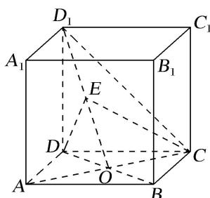
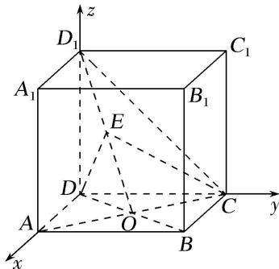

> [!faq]- 《专题14 利用空间向量解决立体几何中的探索性问题-立体几何（理科）》例题解析
>
> > [!success]- **【答案】** 详见解析
>
> > [!note]- **【分析】**
> > 本题未单列分析。
>
> > [!note]- **【解析】**
> > (1)若点 E 为 $OD_{1}$ 的中点，求直线 $OD_{1}$ 与平面 CDE 所成角的正弦值；
> >
> > (2)是否存在点 E，使得平面 $CDE \perp$ 平面 $CD_{1}O$ ？若存在，请指出点 E 的位置，并加以证明；若不存在，请说明理由.
> >
> > 
> >
> > 6. 解析
> > (1)不妨设正方体的棱长为 2. 以 $D$ 为坐标原点, 分别以 $DA$ , $DC$ , $DD_{1}$ 所在直线分别为 $x$ 轴, $y$ 轴, $z$ 轴, 建立如图所示的空间直角坐标系 $D - xyz$ ,
> >
> > 
> >
> > 则 $D(0, 0, 0)$ , $D_{1}(0, 0, 2)$ , $C(0, 2, 0)$ , $O(1, 1, 0)$ . 因为 $E$ 为 $OD_{1}$ 的中点, 所以 $E\left(\frac{1}{2}, \frac{1}{2}, 1\right)$ . 则 $\overrightarrow{OD}_{1}=(-1, -1, 2)$ , $\overrightarrow{DE}=\left(\frac{1}{2}, \frac{1}{2}, 1\right)$ , $\overrightarrow{DC}=(0, 2, 0)$ .
> >
> > 设 $p=(x_{0}, y_{0}, z_{0})$ 是平面 $CDE$ 的法向量, 则 $\left\{\begin{aligned}&p \cdot \overrightarrow{DE}=0,\\ &p \cdot \overrightarrow{DC}=0,\end{aligned}\right.$ 即 $\left\{\begin{aligned}&\frac{1}{2}x_{0}+\frac{1}{2}y_{0}+z_{0}=0,\\ &2y_{0}=0,\end{aligned}\right.$ 取 $x_{0}=2$ , 则 $y_{0}=0$ , $z_{0}=-1$ , 所以 $p=(2, 0, -1)$ 为平面 $CDE$ 的一个法向量.
> >
> > 设直线 $OD_{1}$ 与平面 $CDE$ 所成角为 $\theta$ ,
> >
> > 所以 $\sin \theta=|\cos<\overrightarrow{OD}_{1}$ , $p>|=\frac{|\overrightarrow{OD}_{1} \cdot p|}{|\overrightarrow{OD}_{1}||p|}=\frac{|-1\times2+(-1)\times0+2\times(-1)|}{\sqrt{(-1)^{2}+(-1)^{2}+2^{2}}\times\sqrt{2^{2}+(-1)^{2}}}=\frac{2\sqrt{30}}{15}$ ,
> >
> > 即直线 $OD_{1}$ 与平面 $CDE$ 所成角的正弦值为 $\frac{2\sqrt{30}}{15}$ .
> >
> > (2)存在, 且点 $E$ 为线段 $OD_{1}$ 上靠近点 $O$ 的三等分点. 理由如下.
> >
> > 假设存在点 $E$ , 使得平面 $CDE \perp$ 平面 $CD_{1}O$ . 同第
> > (1)问建立空间直角坐标系, 易知点 $E$ 不与点 $O$ 重合
> >
> > 设 $\overrightarrow{D_{1}E}=\lambda\overrightarrow{EO}$ , $\lambda\in[0, +\infty)$ , $\overrightarrow{OC}=(-1, 1, 0)$ , $\overrightarrow{OD}_{1}=(-1, -1, 2)$ .
> >
> > 设 $m=(x_{1}, y_{1}, z_{1})$ 是平面 $CD_{1}O$ 的法向量, 则 $\left\{\begin{aligned}&m \cdot \overrightarrow{OC}=0,\\ &m \cdot \overrightarrow{OD}_{1}=0,\end{aligned}\right.$ 即 $\left\{\begin{aligned}&-x_{1}+y_{1}=0,\\ &-x_{1}-y_{1}+2z_{1}=0,\end{aligned}\right.$ 取 $x_{1}=1$ , 则 $y_{1}=1$ , $z_{1}=1$ , 所以 $m=(1, 1, 1)$ 为平面 $CD_{1}O$ 的一个法向量.
> >
> > 因为 $\overrightarrow{D_{1}E}=\lambda\overrightarrow{EO}$ , 所以点 $E$ 的坐标为 $\left(\frac{\lambda}{1+\lambda}, \frac{\lambda}{1+\lambda}, \frac{2}{1+\lambda}\right)$ , 所以 $\overrightarrow{DE}=\left(\frac{\lambda}{1+\lambda}, \frac{\lambda}{1+\lambda}, \frac{2}{1+\lambda}\right)$ .
> >
> > 设 $n=(x_{2}, y_{2}, z_{2})$ 是平面 $CDE$ 的法向量, 则 $\left\{\begin{aligned}&n \cdot \overrightarrow{DE}=0,\\ &n \cdot \overrightarrow{DC}=0,\end{aligned}\right.$ 即 $\left\{\begin{aligned}&\frac{\lambda}{1+\lambda}x_{2}+\frac{\lambda}{1+\lambda}y_{2}+\frac{2}{1+\lambda}z_{2}=0,\\ &2y_{2}=0,\end{aligned}\right.$ 取 $x_{2}=1$ , 则 $y_{2}=0$ , $z_{2}=-\frac{\lambda}{2}$ , 所以 $n=\left(1, 0,-\frac{\lambda}{2}\right)$ 为平面 $CDE$ 的一个法向量.
> >
> > 因为平面 $CDE \perp$ 平面 $CD_{1}O$ , 所以 $m \perp n$ . 则 $m \cdot n=0$ , 所以 $1-\frac{\lambda}{2}=0$ , 解得 $\lambda=2$ .
> >
> > 所以当 $\frac{\overrightarrow{D_{1}E}}{\overrightarrow{EO}}=2$ , 即点 $E$ 为线段 $OD_{1}$ 上靠近点 $O$ 的三等分点时, 平面 $CDE \perp$ 平面 $CD_{1}O$ .
