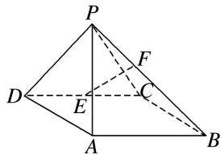

<!-- question-source:start -->
[例1] 如图所示，在四棱锥 $P - ABCD$ 中，侧面 $PAD \perp$ 底面 $ABCD$ ，底面 $ABCD$ 是平行四边形， $\angle ABC = 45^{\circ}$ ， $AD = AP = 2$ ， $AB = DP = 2\sqrt{2}$ ， $E$ 为 $CD$ 的中点，点 $F$ 在线段 $PB$ 上.

(1)求证： $AD \perp PC;$

(2)试确定点 F 的位置，使得直线 EF 与平面 PDC 所成的角和直线 EF 与平面 ABCD 所成的角相等.

<!-- question-source:end -->

![[高中/总复习/专题/立体几何/专题14 利用空间向量解决立体几何中的探索性问题-立体几何（理科）/考点02_探究线面的数量关系/例题/answers/Q00043820A1.md]]
