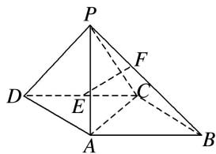
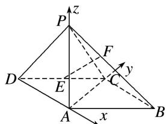

<!-- question-source:start -->
[例1] 如图所示，在四棱锥 $P - ABCD$ 中，侧面 $PAD \perp$ 底面 $ABCD$ ，底面 $ABCD$ 是平行四边形， $\angle ABC = 45^{\circ}$ ， $AD = AP = 2$ ， $AB = DP = 2\sqrt{2}$ ， $E$ 为 $CD$ 的中点，点 $F$ 在线段 $PB$ 上.

(1)求证： $AD \perp PC;$

(2)试确定点 F 的位置，使得直线 EF 与平面 PDC 所成的角和直线 EF 与平面 ABCD 所成的角相等.

(1)如图所示，在平行四边形ABCD中，连接AC,

因为 $AB=2\sqrt{2}$ ，BC=2， $\angle ABC=45^{\circ}$ ，由余弦定理得， $AC^{2}=AB^{2}+BC^{2}-2\cdot AB\cdot BC\cdot\cos45^{\circ}=4$ ，得 AC=2，所以 $\angle ACB=90^{\circ}$ ，即 $BC\perp AC$ .

又 $AD \parallel BC$ ，所以 $AD \perp AC$ 。因为 $AD = AP = 2, DP = 2\sqrt{2}$ ，所以 $PA \perp AD$ ，

又 $AP \cap AC = A$ ，AP， $AC \subset$ 平面 PAC，所以 $AD \perp$ 平面 PAC，又 $PC \subset$ 平面 PAC，所以 $AD \perp PC$ .

(2)因为侧面 $PAD \perp$ 底面 ABCD， $PA \perp AD$ ，侧面 $PAD \cap$ 底面 ABCD = AD， $PA \subset$ 侧面 PAD，

所以 $PA \perp$ 底面 ABCD，所以直线 AC，AD，AP 两两垂直，以 A 为原点，直线 AD，AC，AP 为坐标轴，建立如图所示的空间直角坐标系 A-xyz，

则 $A(0, 0, 0)$ ， $D(-2, 0, 0)$ ， $C(0, 2, 0)$ ， $B(2, 2, 0)$ ， $E(-1, 1, 0)$ ， $P(0, 0, 2)$ ，

所以 $\overrightarrow{PC}=(0,2,-2)$ ， $\overrightarrow{PD}=(-2,0,-2)$ ， $\overrightarrow{PB}=(2,2,-2)$ .

设 $\frac{PF}{PB}=\lambda(\lambda\in[0,1])$ ，则 $\overrightarrow{PF}=(2\lambda,2\lambda,-2\lambda)$ ， $F(2\lambda,2\lambda,-2\lambda+2)$

所以 $\overrightarrow{EF}=(2\lambda+1,\quad2\lambda-1,\quad-2\lambda+2)$ 。易得平面ABCD的一个法向量为 $m=(0,\quad0,\quad1)$ .

设平面 PDC 的法向量为 $\boldsymbol{n}=(x,y,z)$ ，由 $\left\{\begin{aligned}\boldsymbol{n}\cdot\overrightarrow{PC}&=0,\\ \boldsymbol{n}\cdot\overrightarrow{PD}&=0,\end{aligned}\right.$ 得 $\left\{\begin{aligned}2y-2z&=0,\\ -2x-2z&=0,\end{aligned}\right.$

令 x=1，得 $n=(1,-1,-1)$ .

因为直线 EF 与平面 PDC 所成的角和直线 EF 与平面 ABCD 所成的角相等，

所以 $|\cos < \overrightarrow{EF}, m > | = |\cos < \overrightarrow{EF}, n > |$ ，即 $\frac{|\overrightarrow{EF} \cdot m|}{|\overrightarrow{EF}| |m|} = \frac{|\overrightarrow{EF} \cdot n|}{|\overrightarrow{EF}| |n|}$ ，所以 $|-2\lambda + 2| = \frac{|2\lambda|}{\sqrt{3}}$

即 $\sqrt{3}|\lambda-1|=|\lambda|(\lambda\in[0,1])$ ，解得 $\lambda=\frac{3-\sqrt{3}}{2}$ ，所以 $\frac{PF}{PB}=\frac{3-\sqrt{3}}{2}$

即当 $\frac{PF}{PB} = \frac{3 - \sqrt{3}}{2}$ 时，直线 $EF$ 与平面 $PDC$ 所成的角和直线 $EF$ 与平面 $ABCD$ 所成的角相等.
<!-- question-source:end -->

![[高中/总复习/专题/立体几何/专题14 利用空间向量解决立体几何中的探索性问题-立体几何（理科）/考点02_探究线面的数量关系/例题/answers/Q00043820A1.md]]
