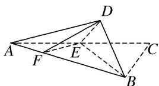
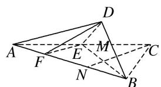
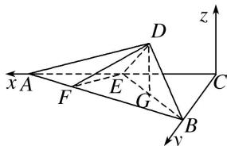

<!-- question-source:start -->
[例 2] 在 Rt△ABC 中，∠C=90°，AC=4，BC=2，E 是 AC 的中点，F 是线段 AB 上一个动点，且 $\overrightarrow{AF} = \lambda \overrightarrow{AB} (0 < \lambda < 1)$ ，如图所示，沿 BE 将 △CEB 翻折至 △DEB 的位置，使得平面 DEB ⊥ 平面 ABE.

(1)当 $\lambda = \frac{1}{3}$ 时，证明： $BD\bot$ 平面DEF；

(2)是否存在 $\lambda$ ，使得 $DF$ 与平面 $ADE$ 所成角的正弦值是 $\frac{\sqrt{2}}{3}$ ？若存在，求出 $\lambda$ 的值；若不存在，请说明理由.

(1)在 $\triangle ABC$ 中， $\angle C=90^{\circ}$ ，即 $AC\perp BC$ ，则 $BD\perp DE$ ，取 $BF$ 的中点 $N$ ，连接 $CN$ 交 $BE$ 于点 $M$ ，

当 $\lambda=\frac{1}{3}$ 时，F是AN的中点，而E是AC的中点，∴EF是△ANC的中位线，∴EF//CN.

在 $\triangle BEF$ 中，N是BF的中点，∴M是BE的中点，

在 Rt△BCE 中，EC=BC=2，∴CM⊥BE，则 EF⊥BE.

又平面 $DEB \perp$ 平面 ABE，平面 $DEB \cap$ 平面 ABE = BE， $EF \subset$ 平面 ABE，∴ $EF \perp$ 平面 DEB.

又 $BD \subset$ 平面 BDE，∴ $EF \perp BD$ 。而 $EF \cap DE = E$ ，EF， $DE \subset$ 平面 DEF，∴ $BD \perp$ 平面 DEF。

(2)存在 $\lambda=\frac{1}{2}$ ，使得DF与平面ADE所成角的正弦值是 $\frac{\sqrt{2}}{3}$ .

以 C 为坐标原点，CA 所在直线为 x 轴，CB 所在直线为 y 轴，建立如图所示的空间直角坐标系.

则 $C(0, 0, 0)$ ， $A(4, 0, 0)$ ， $B(0, 2, 0)$ ， $E(2, 0, 0)$

$\therefore \overrightarrow{AB} = (-4, 2, 0), \overrightarrow{AE} = (-2, 0, 0)$ ，取 $BE$ 的中点 $G$ ，连接 $DG$ ，则 $DG \perp BE$ ，而平面 $DEB \perp$ 平面 $ABC$ ，

∴DG⊥平面ABC，则 $D(1,1,\sqrt{2})$ ，则 $\overrightarrow{AD}=(-3,1,\sqrt{2})$ .

由 $\overrightarrow{AF} = \lambda \overrightarrow{AB}$ ，可得 $F(4 - 4\lambda, 2\lambda, 0)$ ，则 $\overrightarrow{DF} = (3 - 4\lambda, 2\lambda - 1, -\sqrt{2})$

设平面 ADE 的法向量为 $\boldsymbol{n}=(x,y,z)$ ，则 $\left\{\begin{aligned}\boldsymbol{n}\cdot\overrightarrow{AE}&=0,\\ \boldsymbol{n}\cdot\overrightarrow{AD}&=0,\end{aligned}\right.$ 即 $\left\{\begin{aligned}-2x&=0,\\ -3x+y+\sqrt{2}z&=0.\end{aligned}\right.$

令 z = -1，则 $x = 0,\ y = \sqrt{2}$ ，所以 $\boldsymbol{n} = (0, \sqrt{2}, -1)$

设 $DF$ 与平面 $ADE$ 所成的角为 $\theta$ ，则

$\sin \theta = |\cos < \overrightarrow{DF}, n > | = \frac{|\overrightarrow{DF} \cdot n|}{|\overrightarrow{DF}| |n|} = \frac{|\sqrt{2}(2\lambda - 1) + \sqrt{2}|}{\sqrt{3} \cdot \sqrt{(3 - 4\lambda)^2 + (2\lambda - 1)^2 + (-\sqrt{2})^2}} = \frac{\sqrt{2}}{3}$ , 解得 $\lambda = \frac{1}{2}$ 或 $\lambda = 3$ (舍去).

综上，存在 $\lambda = \frac{1}{2}$ ，使得 $DF$ 与平面 $ADE$ 所成的角的正弦值为 $\frac{\sqrt{2}}{3}$ .
<!-- question-source:end -->

![[高中/总复习/专题/立体几何/专题14 利用空间向量解决立体几何中的探索性问题-立体几何（理科）/考点02_探究线面的数量关系/例题/answers/Q00043821A1.md]]
