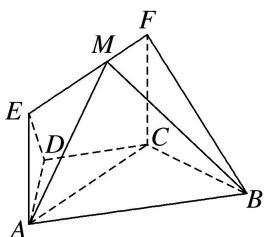

<!-- question-source:start -->
[例 6] 如图所示，在梯形 ABCD 中， $AB \parallel CD$ ， $\angle BCD = 120^{\circ}$ ，四边形 ACFE 为矩形，且 $CF \perp$ 平面 ABCD，AD = CD = BC = CF.

(1)求证： $EF \perp$ 平面 BCF;

(2)点 $M$ 在线段 $EF$ 上运动，当点 $M$ 在什么位置时，平面 $MAB$ 与平面 $FCB$ 所成的锐二面角最大，并求此时二面角的余弦值.

<!-- question-source:end -->

![[高中/总复习/专题/立体几何/专题14 利用空间向量解决立体几何中的探索性问题-立体几何（理科）/考点02_探究线面的数量关系/例题/answers/Q00043827A1.md]]
