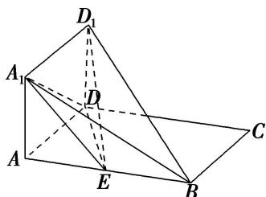

<!-- question-source:start -->
[例8] 如图所示，正方形 $AA_{1}D_{1}D$ 与矩形ABCD所在平面互相垂直， $AB = 2AD = 2$ ，点 $E$ 为 $AB$ 的中点.

(1)求证： $BD_{1}$ // 平面 $A_{1}DE;$

(2)设在线段 $AB$ 上存在点 $M$ ，使二面角 $D_{1} - MC - D$ 的大小为 $\frac{\pi}{6}$ ，求此时 $AM$ 的长及点 $E$ 到平面 $D_{1}MC$ 的距离.

<!-- question-source:end -->

![[高中/总复习/专题/立体几何/专题14 利用空间向量解决立体几何中的探索性问题-立体几何（理科）/考点02_探究线面的数量关系/例题/answers/Q00043829A1.md]]
