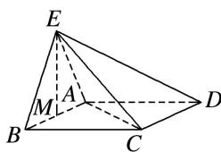
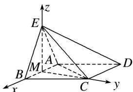

> [!faq]- 《专题14 利用空间向量解决立体几何中的探索性问题-立体几何（理科）》例题解析
>
> > [!success]- **【答案】** 详见解析
>
> > [!note]- **【分析】**
> > 本题未单列分析。
>
> > [!note]- **【解析】**
> > (1)求证： $EM \perp AD;$
> > (2)求二面角 $A - BE - C$ 的余弦值；
> > (3)在线段 $EC$ 上是否存在点 $P$ ，使得直线 $AP$ 与平面 $ABE$ 所成的角为 $45^{\circ}$ ，若存在，求出 $\frac{EP}{EC}$ 的值；若不存在，说明理由.
> > 
> > 解析 (1)∵EA=EB，M是AB的中点，∴EM⊥AB，
> > ∵平面 $ABE \perp$ 平面 ABCD，平面 $ABE \cap$ 平面 ABCD = AB，EM ⊂ 平面 ABE，
> > ∴EM⊥平面ABCD，AD⊂平面ABCD，∴EM⊥AD.
> > (2)连接 MC，∵EM⊥平面 ABCD，∴EM⊥MC，
> > ∵△ABC 是正三角形，∴MC⊥AB，∴MB，MC，ME 两两垂直.
> > 建立如图所示空间直角坐标系 M-xyz.
> > 
> > 则 $M(0, 0, 0)$ , $A(-1, 0, 0)$ , $B(1, 0, 0)$ , $C(0, \sqrt{3}, 0)$ , $E(0, 0, \sqrt{3})$ ,
> > $$
> > \vec {B C} = (- 1, \sqrt {3}, 0), \vec {B E} = (- 1, 0, \sqrt {3}),
> > $$
> > 设 $\boldsymbol{m}=(x,y,z)$ 是平面 BCE 的一个法向量，则 $\left\{\begin{aligned}\boldsymbol{m}\cdot\overrightarrow{BC}&=-x+\sqrt{3}y=0,\\ \boldsymbol{m}\cdot\overrightarrow{BE}&=-x+\sqrt{3}z=0,\end{aligned}\right.$ 令 $z=1,\quad\boldsymbol{m}=(\sqrt{3},1,1)$ ,
> > ∵y轴所在直线与平面ABE垂直，∴ $n=(0,1,0)$ 是平面ABE的一个法向量.
> > $\cos < m, n > = \frac{m \cdot n}{|m||n|} = \frac{1}{\sqrt{5} \times 1} = \frac{\sqrt{5}}{5}, \therefore$ 二面角 $A - BE - C$ 的余弦值为 $\frac{\sqrt{5}}{5}$ .
> > (3)假设在线段 EC 上存在点 P，使得直线 AP 与平面 ABE 所成的角为 $45^{\circ}$ ，
> > $$
> > \vec {A E} = (1, 0, \sqrt {3}), \vec {E C} = (0, \sqrt {3}, - \sqrt {3}),
> > $$
> > 设 $\overrightarrow{EP} = \lambda \overrightarrow{EC} = (0, \sqrt{3}\lambda, -\sqrt{3}\lambda), 0 < \lambda \leqslant 1$ ，则 $\overrightarrow{AP} = \overrightarrow{AE} + \overrightarrow{EP} = (1, \sqrt{3}\lambda, \sqrt{3} - \sqrt{3}\lambda)$ ，
> > ∵直线 AP 与平面 ABE 所成的角为 $45^{\circ}$ ,
> > $$
> > \therefore \sin 4 5 ^ {\circ} = | \cos <   \overrightarrow {A P}, \quad n > | = \frac {| \overrightarrow {A P} \cdot n |}{| \overrightarrow {A P} | | n |} = \frac {| \sqrt {3} \lambda |}{\sqrt {1 + 3 \lambda^ {2} + 3 - 6 \lambda + 3 \lambda^ {2}} \times 1} = \frac {\sqrt {2}}{2}, \text {由} 0 \leqslant \lambda \leqslant 1, \text {解得} \lambda = \frac {2}{3},
> > $$
> > ∴在线段 EC 上存在点 P，使得直线 AP 与平面 ABE 所成的角为 $45^{\circ}$ ，且 $\frac{EP}{EC} = \frac{2}{3}$ .
