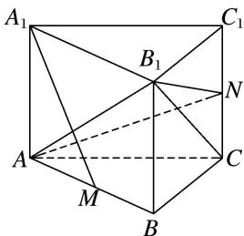
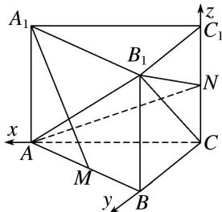

> [!faq]- 《专题14 利用空间向量解决立体几何中的探索性问题-立体几何（理科）》例题解析
>
> > [!success]- **【答案】** 详见解析
>
> > [!note]- **【分析】**
> > 本题未单列分析。
>
> > [!note]- **【解析】**
> > (1)求 $A_{1}A$ 的长；
> > (2)已知点 $N$ 在棱 $CC_{1}$ 上，若平面 $B_{1}AN$ 与平面 $BCC_{1}B_{1}$ 夹角的余弦值为 $\frac{\sqrt{10}}{10}$ ，试确定点 $N$ 的位置.
> > 
> > 解析 (1)建立如图所示的空间直角坐标系．设 $A_{1}A=a$ ．由 $AB=4\sqrt{2}$ ，得 AC=BC=4，
> > 
> > 则 $A(4, 0, 0)$ ， $C(0, 0, 0)$ ， $A_{1}(4, 0, a)$ ， $B_{1}(0, 4, a)$ ， $M(2, 2, 0)$ ，
> > 所以 $\overrightarrow{A_{1}M}=(-2,2,-a)$ ， $\overrightarrow{B_{1}C}=(0,-4,-a)$ .
> > 因为 $A_{1}M \perp B_{1}C$ ，所以 $(-2) \times 0 + 2 \times (-4) + (-a) \times (-a) = 0$ ，解得 $a = 2\sqrt{2}$ ，即 $A_{1}A$ 的长为 $2\sqrt{2}$ .
> > (2)由(1)知 $C_{1}(0, 0, 2\sqrt{2})$ . 设 $N(0, 0, \lambda)(0 \leqslant \lambda \leqslant 2\sqrt{2})$ ,
> > 所以 $\overrightarrow{B_1A} = (4, -4, -2\sqrt{2})$ ， $\overrightarrow{B_1N} = (0, -4, \lambda - 2\sqrt{2})$
> > 设平面 $B_{1}AN$ 的一个法向量为 $\boldsymbol{n}_{1}=(x_{1},y_{1},z_{1})$ . 由 $\left\{\begin{aligned}\boldsymbol{n}_{1}\perp\overrightarrow{B_{1}A}\\ \boldsymbol{n}_{1}\perp\overrightarrow{B_{1}N},\end{aligned}\right.$ 得 $\left\{\begin{aligned}4x_{1}-4y_{1}-2\sqrt{2}z_{1}=0,\\ -4y_{1}+(\lambda-2\sqrt{2})z_{1}=0,\end{aligned}\right.$
> > 取 $n_{1}=\left(1,1-\frac{2\sqrt{2}}{\lambda},\frac{4}{\lambda}\right)$ . 易知平面 $BCC_{1}B_{1}$ 的一个法向量为 $\boldsymbol{n}_{2}=(1,0,0)$ ，设平面 $B_{1}AN$ 与平面 $BCC_{1}B_{1}$ 的夹角为 $\theta$ ，
> > $$
> > \cos \theta = | \cos <   n _ {1}, n _ {2} > | = \frac {| n _ {1} \cdot n _ {2} |}{| n _ {1} | | n _ {2} |} = \frac {1}{\sqrt {1 + \left(1 - \frac {2 \sqrt {2}}{\lambda}\right) ^ {2} + \left(\frac {4}{\lambda}\right) ^ {2}}} = \frac {\sqrt {1 0}}{1 0}.
> > $$
> > 解得 $\lambda = \sqrt{2}$ 或 $\lambda = -\frac{3\sqrt{2}}{2}$ (舍去)，所以 $N$ 在棱 $CC_{1}$ 的中点处.
