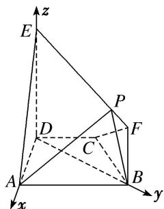

> [!faq]- 《专题14 利用空间向量解决立体几何中的探索性问题-立体几何（理科）》例题解析
>
> > [!success]- **【答案】** 详见解析
>
> > [!note]- **【分析】**
> > 本题未单列分析。
>
> > [!note]- **【解析】**
> > (1)求证： $AD \perp$ 平面 BFED;
> > (2)在线段 $EF$ 上是否存在一点 $P$ , 使得平面 $PAB$ 与平面 $ADE$ 所成的锐二面角的余弦值为 $\frac{5\sqrt{7}}{28}$ ? 若存在, 求出点 $P$ 的位置; 若不存在, 说明理由.
> > 
> > 解析 (1)在梯形ABCD中，因为 $AB \parallel CD$ ，AD=DC=CB=1， $\angle BCD=120^{\circ}$
> > 所以 $\angle CDB=30^{\circ}$ ，所以 $\angle ADB=90^{\circ}$ ，所以 $BD\perp AD$ .
> > 因为平面 $BFED \perp$ 平面 ABCD，平面 $BFED \cap$ 平面 ABCD = BD, AD ⊂ 平面 ABCD，所以 $AD \perp$ 平面 BFED.
> > 
> > (2)因为 $AD \perp$ 平面 BFED，所以 $AD \perp DE$ .
> > 以 D 为原点，分别以 DA，DB，DE 所在直线为 x 轴，y 轴，z 轴建立如图所示的空间直角坐标系，在 $\triangle BCD$ 中，DC = BC = 1， $\angle BCD = 120^{\circ}$ ，由余弦定理得 $BD = \sqrt{3}$ ，
> > 则 $A(1, 0, 0)$ ， $B(0, \sqrt{3}, 0)$ ，由题意，设 $P\left\{0, \lambda, 2 - \frac{\sqrt{3}}{3}\lambda\right\}(0 \leq \lambda \leq 3)$ ,
> > 所以 $\overrightarrow{AB}=(-1,\sqrt{3},0)$ ， $\overrightarrow{BP}=\left(0,\lambda-\sqrt{3},2-\frac{\sqrt{3}}{3}\lambda\right)$ .
> > 易知平面 EAD 的一个法向量为 $m=(0,1,0)$ ,
> > 设平面 PAB 的法向量为 $n=(x, y, z)$ ，由 $\left\{\begin{aligned}\overrightarrow{AB} \cdot n=0, \\ \overrightarrow{BP} \cdot n=0,\end{aligned}\right.$ 得 $\left\{\begin{aligned}-x+\sqrt{3}y=0,\\ \lambda-\sqrt{3}y+\left(2-\frac{\sqrt{3}}{3}\lambda\right)z=0,\end{aligned}\right.$
> > 取 y=1，可得 $n=\left(\sqrt{3},\quad1,\quad\frac{\sqrt{3}-\lambda}{2-\frac{\sqrt{3}}{3}\lambda}\right)$ .
> > 因为平面 PAB 与平面 ADE 所成的锐二面角的余弦值为 $\frac{5\sqrt{7}}{28}$ ,
> > 所以 $|\cos < m, n > | = \frac{|m \cdot n|}{|m||n|} = \sqrt{\frac{1}{3 + 1 + \left(\frac{\sqrt{3} - \lambda}{2 - \frac{\sqrt{3}}{3}\lambda}\right)^2}} = \frac{5\sqrt{7}}{28},$
> > 解得 $\lambda = \frac{\sqrt{3}}{3}$ ， $\therefore$ 线段 $EF$ 上存在满足题意的点 $P$ ，此时， $\frac{EP}{EF} = \frac{\lambda}{\sqrt{3}} = \frac{1}{3}$ ，
> > 即 P 为线段 EF 上靠近点 E 的三等分点.
