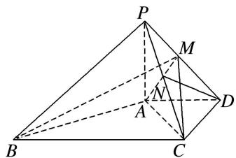
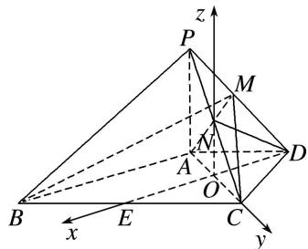

> [!faq]- 《专题14 利用空间向量解决立体几何中的探索性问题-立体几何（理科）》例题解析
>
> > [!success]- **【答案】** 详见解析
>
> > [!note]- **【分析】**
> > 本题未单列分析。
>
> > [!note]- **【解析】**
> > (1)取 $PC$ 的中点 $N$ , 求证: $DN \parallel$ 平面 $PAB$ ;
> > (2)求直线 $AC$ 与 $PD$ 所成角的余弦值；
> > (3)在线段 $PD$ 上，是否存在一点 $M$ ，使得平面 $MAC$ 与平面 $ACD$ 的夹角为 $45^{\circ}$ ？如果存在，求出 $BM$ 与平面 $MAC$ 所成角的大小；如果不存在，请说明理由.
> > 
> > 解析 (1)取 BC 的中点 E，连接 DE，交 AC 于点 O，连接 ON，建立如图所示的空间直角坐标系，
> > 
> > 则 $A(0, -1, 0)$ ， $B(2, -1, 0)$ ， $C(0, 1, 0)$ ， $D(-1, 0, 0)$ ， $P(0, -1, 2)$ .
> > ∵点N为PC的中点，∴ $N(0,0,1)$ ，∴ $\overrightarrow{DN}=(1,0,1)$ .
> > 设平面 PAB 的一个法向量为 $\boldsymbol{n}=(x,y,z)$ ，由 $\overrightarrow{AP}=(0,0,2)$ ， $\overrightarrow{AB}=(2,0,0)$ ，可得 $\boldsymbol{n}=(0,1,0)$ ， $\therefore\overrightarrow{DN}\cdot n=0$ ．又∵DN∉平面PAB，∴DN//平面PAB.
> > (2)由(1)知， $\overrightarrow{AC}=(0,2,0)$ ， $\overrightarrow{PD}=(-1,1,-2)$ .
> > 设直线 AC 与 PD 所成的角为 $\theta$ ，则 $\cos\theta=\frac{|\overrightarrow{AC}\cdot\overrightarrow{PD}|}{|\overrightarrow{AC}||\overrightarrow{PD}|}=\left|\frac{2}{2\times\sqrt{6}}\right|=\frac{\sqrt{6}}{6}.$
> > (3)存在．设 $M(x, y, z)$ ，且 $\overrightarrow{PM} = \lambda \overrightarrow{PD}, 0 \leqslant \lambda \leqslant 1, \therefore \begin{cases} x = -\lambda, \\ y + 1 = \lambda, \\ z - 2 = -2\lambda, \end{cases}$ $\therefore M(-\lambda, \lambda - 1, 2 - 2\lambda).$
> > 设平面 ACM 的一个法向量为 $\boldsymbol{m}=(a, b, c)$ ，由 $\overrightarrow{AC}=(0, 2, 0)$ ， $\overrightarrow{AM}=(-\lambda, \lambda, 2-2\lambda)$ ，
> > 可得 $\boldsymbol{m}=(2-2\lambda,\quad0,\quad\lambda)$ ，由图知平面 ACD 的一个法向量为 $\boldsymbol{u}=(0,\quad0,\quad1)$ ,
> > $\therefore |\cos < m, u > | = \frac{\lambda}{1 \cdot \sqrt{\lambda^2 + (2 - 2\lambda)^2}} = \frac{\sqrt{2}}{2}$ , 解得 $\lambda = \frac{2}{3}$ 或 $\lambda = 2$ (舍去).
> > $$
> > \therefore M \left[ - \frac {2}{3}, - \frac {1}{3}, \frac {2}{3} \right], m = \left[ \frac {2}{3}, 0, \frac {2}{3} \right]. \therefore \overrightarrow {B M} = \left[ - \frac {8}{3}, \frac {2}{3}, \frac {2}{3} \right],
> > $$
> > 设 BM 与平面 MAC 所成的角为 $\varphi$ ，则 $\sin \varphi = |\cos < \overrightarrow{BM}, m > | = \left| \frac{\frac{12}{9}}{\frac{2\sqrt{2}}{3} \times 2\sqrt{2}} \right| = \frac{1}{2}, \therefore \varphi = 30^{\circ}.$
> > 故存在点 M，使得平面 MAC 与平面 ACD 的夹角为 $45^{\circ}$ ，此时 BM 与平面 MAC 所成的角为 $30^{\circ}$ .
