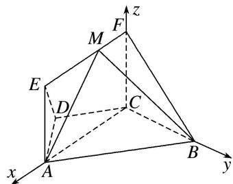

> [!faq]- 《专题14 利用空间向量解决立体几何中的探索性问题-立体几何（理科）》例题解析
>
> > [!success]- **【答案】** 详见解析
>
> > [!note]- **【解析】**
> > 解析
> > (1) 设 $AD = CD = BC = 1$ ， $\because AB \parallel CD$ ， $\angle BCD = 120^\circ$ ， $\therefore AB = 2$
> >
> > $\therefore AC^{2} = AB^{2} + BC^{2} - 2AB\cdot BC\cdot \cos 60^{\circ} = 3,\therefore AB^{2} = AC^{2} + BC^{2}$ ，则 $BC\bot AC$
> >
> > ∵CF⊥平面ABCD，AC⊂平面ABCD，∴AC⊥CF，而CF∩BC=C，CF，BC⊂平面BCF，
> >
> > ∴AC⊥平面BCF. ∵EF∥AC, ∴EF⊥平面BCF.
> >
> > (2)以 C 为坐标原点，分别以直线 CA, CB, CF 为 x 轴、y 轴、z 轴建立如图所示的空间直角坐标系，
> >
> > 
> >
> > 设 $FM=\lambda(0\leqslant\lambda\leqslant\sqrt{3})$ ，则 $C(0,0,0)$ ， $A(\sqrt{3},0,0)$ ， $B(0,1,0)$ ， $M(\lambda,0,1)$ ，
> >
> > $$
> > \therefore \overrightarrow {A B} = (- \sqrt {3}, 1, 0), \overrightarrow {B M} = (\lambda , - 1, 1).
> > $$
> >
> > 设 $\boldsymbol{n}=(x,y,z)$ 为平面 MAB 的法向量，由 $\left\{\begin{aligned}\boldsymbol{n}\cdot\overrightarrow{AB}&=0,\\ \boldsymbol{n}\cdot\overrightarrow{BM}&=0,\end{aligned}\right.$ 得 $\left\{\begin{aligned}-\sqrt{3}x+y&=0,\\ \lambda x-y+z&=0,\end{aligned}\right.$
> >
> > 取 x=1，则 $n=(1,\sqrt{3},\sqrt{3}-\lambda)$ .
> >
> > 易知 $m=(1,0,0)$ 是平面 FCB 的一个法向量，
> >
> > $\therefore \cos < n, m > = \frac{n \cdot m}{|n||m|} = \frac{1}{\sqrt{1 + 3 + (\sqrt{3} - \lambda)^2} \times 1} = \frac{1}{\sqrt{(\lambda - \sqrt{3})^2 + 4}}.$
> >
> > $\because 0 \leqslant \lambda \leqslant \sqrt{3}, \therefore$ 当 $\lambda = 0$ 时， $\cos < n, m>$ 取得最小值 $\frac{\sqrt{7}}{7}$ ，
> >
> > ∴当点 M 与点 F 重合时，平面 MAB 与平面 FCB 所成的锐二面角最大，此时二面角的余弦值为 $\frac{\sqrt{7}}{7}$ .
