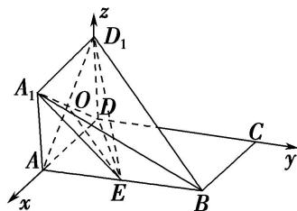

> [!faq]- 《专题14 利用空间向量解决立体几何中的探索性问题-立体几何（理科）》例题解析
>
> > [!success]- **【答案】** B
>
> > [!note]- **【解析】**
> > 解析
> > (1)连接 $AD_{1}$ ，交 $A_{1}D$ 于点 O，∵ 四边形 $AA_{1}D_{1}D$ 为正方形，
> >
> > ∴ O 是 $AD_{1}$ 的中点，∵ 点 E 为 AB 的中点，连接 OE.
> >
> > ∴EO 为 $\triangle ABD_{1}$ 的中位线，∴ $EO \parallel BD_{1}$ .
> >
> > 又∵ $BD_{1}\notin$ 平面 $A_{1}DE$ ， $OE\subset$ 平面 $A_{1}DE$ ，∴ $BD_{1}//$ 平面 $A_{1}DE$ .
> >
> > 
> >
> > (2)由题意可得 $D_{1}D \perp$ 平面 ABCD，以点 D 为原点，DA，DC， $DD_{1}$ 所在直线分别为 x 轴、y 轴、z 轴，建立如图所示的空间直角坐标系，则 $D(0, 0, 0)$ ， $C(0, 2, 0)$ ， $A_{1}(1, 0, 1)$ ， $D_{1}(0, 0, 1)$ ， $B(1, 2, 0)$ ， $E(1, 1, 0)$ ，
> >
> > 设 $M(1, y_{0}, 0)(0 \leq y_{0} \leq 2)$ ，∵ $\overrightarrow{MC}=(-1, 2-y_{0}, 0)$ ， $\overrightarrow{D_{1}C}=(0, 2, -1)$ ,
> >
> > 设平面 $D_{1}MC$ 的一个法向量为 $\pmb{n}_{1} = (x,y,z)$ ，则 $\left\{ \begin{array}{l}\pmb {n}_{1}\cdot \overrightarrow{MC} = 0,\\ \pmb {n}_{1}\cdot \overrightarrow{D_{1}C} = 0, \end{array} \right.$ 即 $\left\{ \begin{array}{ll} - x + y & 2 - y_0\\ 2y - z = 0, \end{array} \right.$
> >
> > 令 y=1，有 $n_{1}=(2-y_{0},1,2)$ 。而平面 MCD 的一个法向量为 $n_{2}=(0,0,1)$ 。
> >
> > 要使二面角 $D_{1}-MC-D$ 的大小为 $\frac{\pi}{6}$ ,
> >
> > 则 $\cos \frac{\pi}{6} = |\cos < n_1, n_2 > | = \frac{|n_1 \cdot n_2|}{|n_1| \cdot |n_2|} = \frac{2}{\sqrt{2 - y_0^2 + 1^2 + 2^2}} = \frac{\sqrt{3}}{2},$ 解得 $y_{0}=2-\frac{\sqrt{3}}{3}(0\leq y_{0}\leq2)$ ，故 $AM=2-\frac{\sqrt{3}}{3}$ ，此时 $n_{1}=\left(\frac{\sqrt{3}}{3},1,2\right)$ ， $\overrightarrow{D_{1}E}=(1,1,-1)$ .
> >
> > 故点 E 到平面 $D_{1}MC$ 的距离为 $d=\frac{|n_{1}\cdot\overrightarrow{D_{1}E}|}{|n_{1}|}=\frac{1-\frac{\sqrt{3}}{3}}{\frac{4\sqrt{3}}{3}}=\frac{\sqrt{3}-1}{4}$ .
> >
> > ## 【对点训练】
