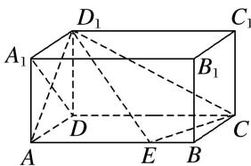

<!-- question-source:start -->
1. 如图，已知在长方体 $ABCD - A_{1}B_{1}C_{1}D_{1}$ 中， $AD = AA_{1} = 1$ ， $AB = 2$ ，点 $E$ 在棱 $AB$ 上移动.

(1)求证： $D_{1}E \perp A_{1}D;$

(2)在棱 $AB$ 上是否存在点 $E$ 使得 $AD_{1}$ 与平面 $D_{1}EC$ 所成的角为 $\frac{\pi}{6}$ ? 若存在, 求出 $AE$ 的长, 若不存在,说明理由.

<!-- question-source:end -->

![[高中/总复习/专题/立体几何/专题14 利用空间向量解决立体几何中的探索性问题-立体几何（理科）/考点02_探究线面的数量关系/对点训练/answers/Q00043830A1.md]]
