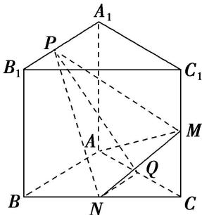

<!-- question-source:start -->
5. 如图，已知直三棱柱 $ABC - A_{1}B_{1}C_{1}$ 中， $AA_{1} = AB = AC = 1$ ， $AB \perp AC$ ， $M$ ， $N$ ， $Q$ 分别是 $CC_{1}$ ， $BC$ ， $AC$ 的中点，点 $P$ 在直线 $A_{1}B_{1}$ 上运动，且 $\overrightarrow{A_1P} = \lambda \overrightarrow{A_1B_1} (\lambda \in [0, 1])$ .

(1)证明：无论 $\lambda$ 取何值，总有 $AM \perp$ 平面 $PNQ$ ;

(2)是否存在点 $P$ ，使得平面 $PMN$ 与平面 $ABC$ 的夹角为 $60^{\circ}$ ? 若存在，试确定点 $P$ 的位置，若不存在，请说明理由.

<!-- question-source:end -->

![[高中/总复习/专题/立体几何/专题14 利用空间向量解决立体几何中的探索性问题-立体几何（理科）/考点02_探究线面的数量关系/对点训练/answers/Q00043834A1.md]]
