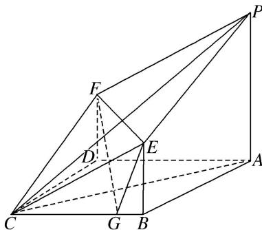

<!-- question-source:start -->
6. 如图所示的几何体由平面 $PECF$ 截棱长为 2 的正方体得到, 其中 $P, C$ 为原正方体的顶点, $E, F$ 为原正方体侧棱长的中点, 正方形 $ABCD$ 为原正方体的底面, $G$ 为棱 $BC$ 上的动点.

(1)求证：平面 $APC \perp$ 平面 PECF;

(2)设 $\overrightarrow{BG}=\lambda\overrightarrow{BC}(0\leq\lambda\leq1)$ ，当 $\lambda$ 为何值时，平面EFG与平面ABCD所成的角为 $\frac{\pi}{3}$ ?

<!-- question-source:end -->

![[高中/总复习/专题/立体几何/专题14 利用空间向量解决立体几何中的探索性问题-立体几何（理科）/考点02_探究线面的数量关系/对点训练/answers/Q00043835A1.md]]
